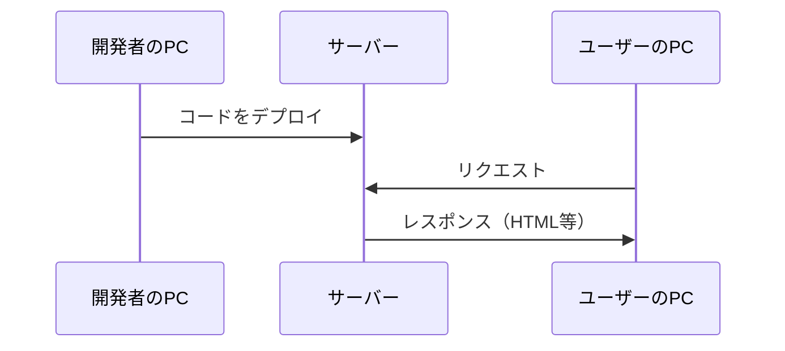
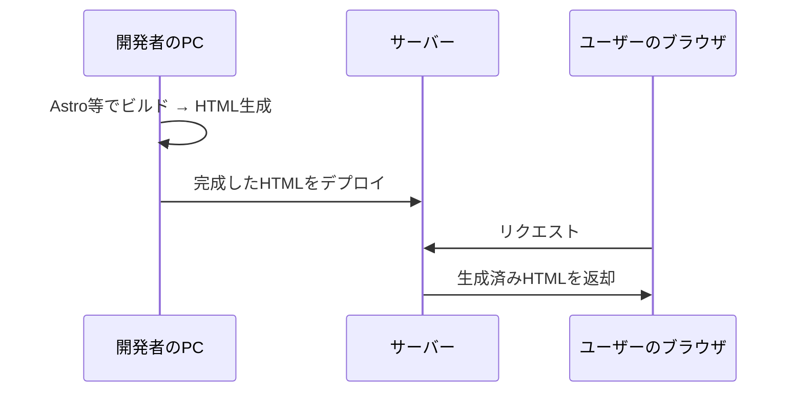
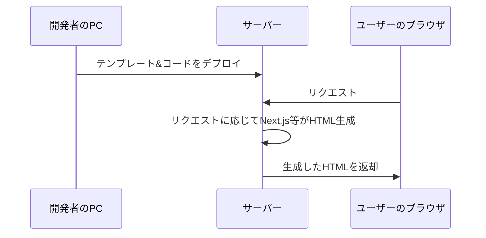
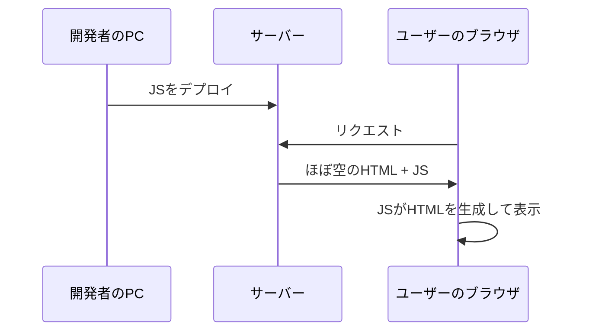

# HTMLレンダリング

フロントエンドエンジニア・マークアップエンジニア向け<br>ステップアップワークショップ 第四回

---

## 前回のおさらい

---

- フレームワークは、それぞれ異なる課題を解決するために生まれた
- **React**: 手続き的なDOM操作の複雑さを、宣言的UIで解決
- **Astro**: SPAの過剰さを、Islands Architectureで解決
- **Bootstrap**: UIの一貫性問題を、プリセットコンポーネントで解決
- **Tailwind**: CSS設計の苦しみを、ユーティリティクラスで解決

---

今回はフレームワーク選定にも深く関わる<br>「HTMLレンダリング」の考え方を学びます。

**HTMLがいつ、どこで生成されるのか**<br>——これを理解すると、フレームワークの使い分けがより明確になります。

---

## 目次

1. HTMLレンダリングとは
2. 【復習】コードが動く場所
3. 3つのレンダリング手法
4. すべての手法を理解する必要性
5. 演習：Astroを使ったSSG

---

## 1. HTMLレンダリングとは

---

「レンダリング」という言葉は、<br>ブラウザがHTMLとCSSを画面に描画することを指す場合もありますが、<br>ここでは別の意味で使います。

---

本ワークショップでの「HTMLレンダリング」とは、<br>**HTMLを生成する行為**のことです。

例えば、エディタでHTMLを手書きすることも、<br>ある種のHTMLレンダリングと言えます。

---

### HTMLの生成方法は進化してきた

1. **手書き**: エディタで `<div>` や `<p>` を直接書く
2. **テンプレートエンジン**: EJS、Pugなどで共通パーツを管理しつつHTMLを生成
3. **フレームワーク**: ReactやAstroがデータに基づいてHTMLを自動生成

---

どの方法でも最終的にはHTMLが生まれますが、<br>**「いつ」「どこで」HTMLが生成されるか**が異なります。

この違いが、これから学ぶレンダリング手法の核心です。

---

## 2. 【復習】コードが動く場所

---

HTMLレンダリングを理解するために、<br>まず「コードが動く3つの場所」を復習します。

---



---

### 開発者のPC

皆さんがコードを書いている環境です。

エディタでHTMLやCSS、JavaScriptを書き、<br>必要に応じてビルド（変換・結合・最適化）を行います。

ポイント：**この段階で完成したHTMLを生成してしまうこともできる**

---

### サーバー

Webサイトのデータを保管し、<br>ユーザーからのリクエストに応じてレスポンスを返すコンピュータです。

ポイント：**リクエストのたびにHTMLを生成することもできる**

---

### ユーザーのブラウザ

ユーザーが実際にWebサイトを閲覧する環境です。

サーバーから受け取ったHTML・CSS・JavaScriptを<br>解釈して画面に表示します。

ポイント：**ブラウザ上でJavaScriptがHTMLを生成することもできる**

---

## 3. 3つのレンダリング手法

---

HTMLが「いつ」「どこで」生成されるかによって、<br>3つの手法に分かれます。

| 手法 | いつ | どこで |
|---|---|---|
| **SSG** | ビルド時 | 開発者のPC |
| **SSR** | リクエスト時 | サーバー |
| **CSR** | 実行時 | ユーザーのブラウザ |

---

### SSG（Static Site Generation）

**ビルド時にHTMLを生成し、<br>完成したHTMLファイルをサーバーに置く方式です。**

---



---

#### マークアップエンジニアにとって最も馴染み深い

「HTMLを書いてサーバーにデプロイする」という作業は、<br>手動のSSGとも言えます。

SSGはこれを自動化したものです。

```
手動SSG（従来の制作フロー）:
  エディタでHTMLを書く → サーバーにデプロイ

自動SSG（フレームワーク利用）:
  コンポーネントを書く → ビルドコマンドでHTMLを生成 → サーバーにデプロイ
```

---

#### SSGに向いているサイト

- 企業のコーポレートサイト
- ブログ・メディアサイト
- ドキュメントサイト
- LP（ランディングページ）

**共通点**: コンテンツが頻繁には変わらない

---

#### SSGの特徴

- 表示が非常に速い（生成済みHTMLを返すだけ）
- サーバーの負荷が低い
- セキュリティリスクが低い
- コンテンツ更新のたびにビルド＆デプロイが必要
- ユーザーごとに異なる内容を出しにくい

---

#### 代表的なフレームワーク

- **Astro** — 前回紹介。コンテンツサイトに最適
- **Next.js** — SSGモードあり（SSRも可能）
- **Gatsby** — React製のSSG特化フレームワーク

---

### SSR（Server Side Rendering）

**ユーザーがページにアクセスするたびに、<br>サーバーがHTMLを生成して返す方式です。**

---



---

#### PHPの時代から使われてきた

SSRは実は古くからある手法です。

PHPやRuby on Railsなど、<br>サーバーサイドの言語でHTMLを生成する方式はすべてSSRです。

---

```php
<!-- PHP: リクエストのたびにHTMLを生成 -->
<?php
$user = getUserFromDB($_SESSION['user_id']);
?>
<html>
  <body>
    <h1>こんにちは、<?php echo $user->name; ?>さん</h1>
    <p>最終ログイン: <?php echo $user->last_login; ?></p>
  </body>
</html>
```

---

#### SSRに向いているサイト

- ECサイト（ユーザーごとのカート、おすすめ商品）
- SNS（ログインユーザーごとのタイムライン）
- 管理画面（権限ごとに表示が変わる）
- リアルタイム性が求められるサイト

**共通点**: ユーザーやタイミングによって表示内容が変わる

---

#### SSRの特徴

- ユーザーごとに異なる内容を返せる
- 常に最新のデータを表示できる
- SEOに有利（完成したHTMLが返る）
- リクエストのたびにサーバーで処理が走る
- サーバーの負荷が高くなりやすい

---

#### 代表的なフレームワーク

- **Next.js** — ReactベースでSSRが得意
- **Nuxt.js** — VueベースのSSRフレームワーク
- **Ruby on Rails / Laravel / Django** — 伝統的なSSRフレームワーク

---

### CSR（Client Side Rendering）

**サーバーはほぼ空のHTMLを返し、<br>ブラウザ上でJavaScriptがHTMLを生成する方式です。**

---



---

#### サーバーが返すHTML

CSRでは、サーバーが返すHTMLは中身がほぼありません。

```html
<!DOCTYPE html>
<html>
  <body>
    <div id="root"></div>          <!-- 中身は空！ -->
    <script src="/app.js"></script> <!-- このJSがHTMLを生成 -->
  </body>
</html>
```

---

```jsx
// app.js（React）: ブラウザ上でHTMLを生成
function App() {
  const [todos, setTodos] = useState([]);

  return (
    <div>
      <h1>TODOリスト</h1>
      <ul>
        {todos.map(todo => <li key={todo.id}>{todo.text}</li>)}
      </ul>
    </div>
  );
}
// ↑ このコードがブラウザで実行され、DOMが構築される
```

---

#### CSRに向いているサイト

- Webアプリケーション（GmailやSlackのような）
- 管理ダッシュボード
- リアルタイムチャット
- インタラクティブなツール

**共通点**: ページ遷移なしに、頻繁にUIが変化する

---

#### CSRの特徴

- ページ遷移なしでUIが切り替わる（快適な操作感）
- サーバー負荷が低い（HTMLを生成しない）
- リッチなインタラクションが可能
- 初期表示が遅い（JSの読み込み・実行が必要）
- SEOに不利（検索エンジンがJSを実行しないと中身が見えない）

---

#### 代表的なフレームワーク

- **React**
- **Vue.js**
- **Angular**

---

## 4. すべての手法を理解する必要性

---

### 「マークアップエンジニアはSSGだけ知ればいい」のか？

答えは **No** 

---

#### プロジェクトのレンダリング手法を理解する必要がある

参加するプロジェクトがSSRやCSRを採用している場合、<br>HTMLの書き方や考え方が変わります。

---

| | SSG | SSR | CSR |
|---|---|---|---|
| HTMLを書く場所 | `.html` or テンプレート | サーバーサイドのテンプレート | JSXなどのコンポーネント |
| 動的な値の埋め込み | ビルド時に確定 | リクエスト時に埋め込む | ブラウザで実行時に埋め込む |

---

#### 実際のプロダクトはハイブリッド

現代のフレームワーク（Next.js、Astroなど）は、<br>**1つのプロジェクト内でSSG・SSR・CSRを混在**させることができます。

---

```
例：ECサイト
├── トップページ      → SSG（コンテンツは固定）
├── 商品一覧         → SSR（在庫状況をリアルタイム表示）
├── 商品詳細         → SSG + CSR（基本情報はSSG、レビューはCSRで動的取得）
├── カート           → CSR（ユーザー操作に即座に反応）
└── 会社概要         → SSG（ほぼ更新されない）
```

---

ページの特性に応じて最適な手法を選ぶのが<br>現代のフロントエンド開発です。

---

## 5. 演習：Astroを使ったSSG

---

前回紹介したAstroを使って、SSGを体験してみましょう。

---

### 環境準備

```bash
# Astroプロジェクトを作成
npm create astro@latest my-ssg-site

# プロジェクトに移動
cd my-ssg-site

# 開発サーバーを起動
npm run dev
```

---

### Astroコンポーネントの基本構造

```astro
\---
// フロントマター（ビルド時に実行される）
const title = "はじめてのAstro";
const items = ["HTML", "CSS", "JavaScript"];
\---

<html>
  <head>
	<meta charset="UTF-8">
  <title>{title}</title>
  </head>
  <body>
    <h1>{title}</h1>
    <ul>
      {items.map(item => <li>{item}</li>)}
    </ul>
  </body>
</html>
```

---

`---` で囲まれた部分（フロントマター）は<br>**ビルド時に実行** されます。

ブラウザで実行されるコードには影響しません。

---

### ビルドしてみる

```bash
# 本番用HTMLを生成
npm run build
```

`dist/` フォルダに完成したHTMLファイルが出力されます。

---

### 演習課題

サンプルCSVデータ: [countries.csv](./demo/countries.csv)

---

1. Astroプロジェクトを作成し、CSVデータを表示するウェブサイトを作ってみましょう
   - **一覧画面**: 全100カ国を表示
   - **詳細画面**: 各国の詳細情報を表示


2. 一覧画面にIslands Architectureを利用した絞り込み機能を実装してみましょう
   - Reactコンポーネントで地域（region）による絞り込みUI を作成
   - `client:load` ディレクティブでCSRを有効化

3. 好みのCSSフレームワークでスタイリングしてみましょう
4. `npm run build` を実行し、`dist/` フォルダの中身を確認してみましょう
5. 生成されたHTMLファイルをブラウザで直接開いてみましょう（サーバー不要で表示できることを確認）

---

## まとめ

---

- HTMLレンダリングとは「HTMLを生成する行為」のこと
- HTMLが **いつ・どこで** 生成されるかで、3つの手法に分かれる
  - **SSG**: ビルド時に開発者のPCで生成
  - **SSR**: リクエスト時にサーバーで生成
  - **CSR**: 実行時にブラウザで生成

- マークアップエンジニアは普段からSSGに近いことをしている
- 現代のフレームワークはこれらを **ハイブリッド** に組み合わせる

---

## 次回予告

第五回：Next.jsを用いたWebアプリケーション

SSRとCSRを組み合わせたフレームワーク「Next.js」を使って、<br>実際のWebアプリケーション開発を体験します。
