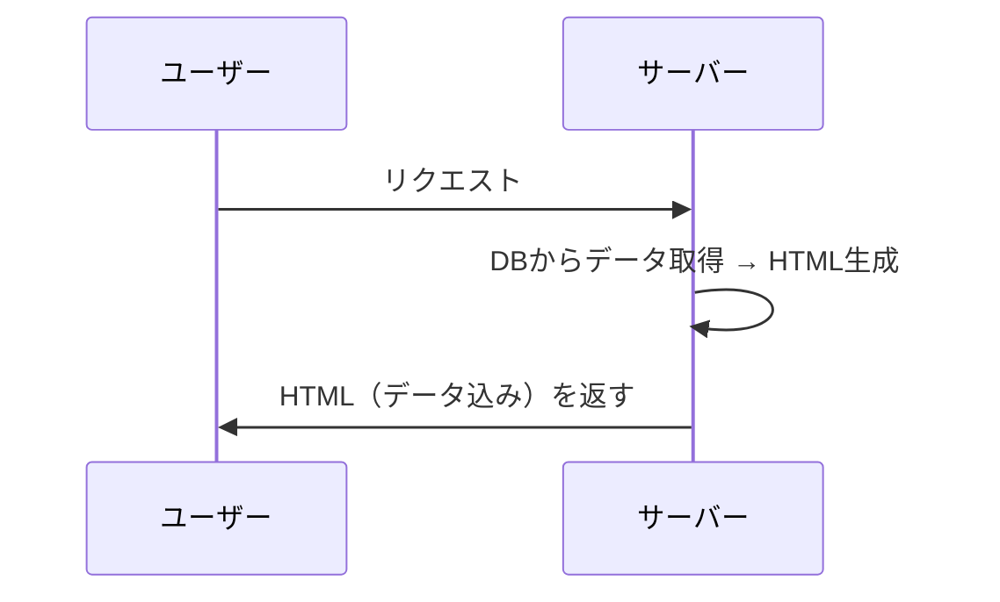
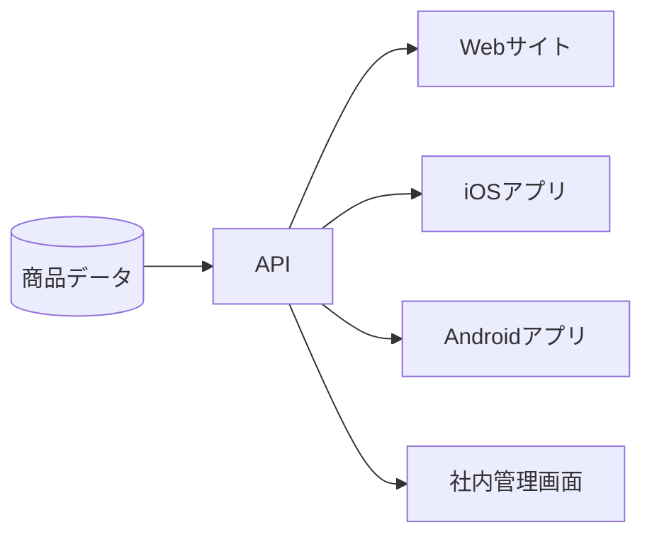
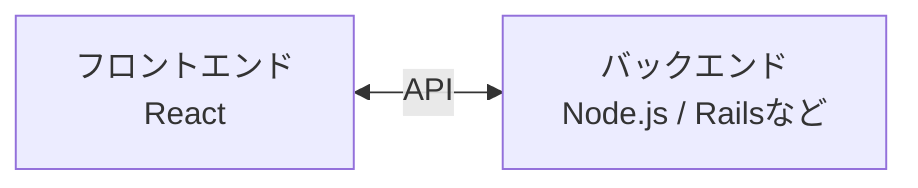
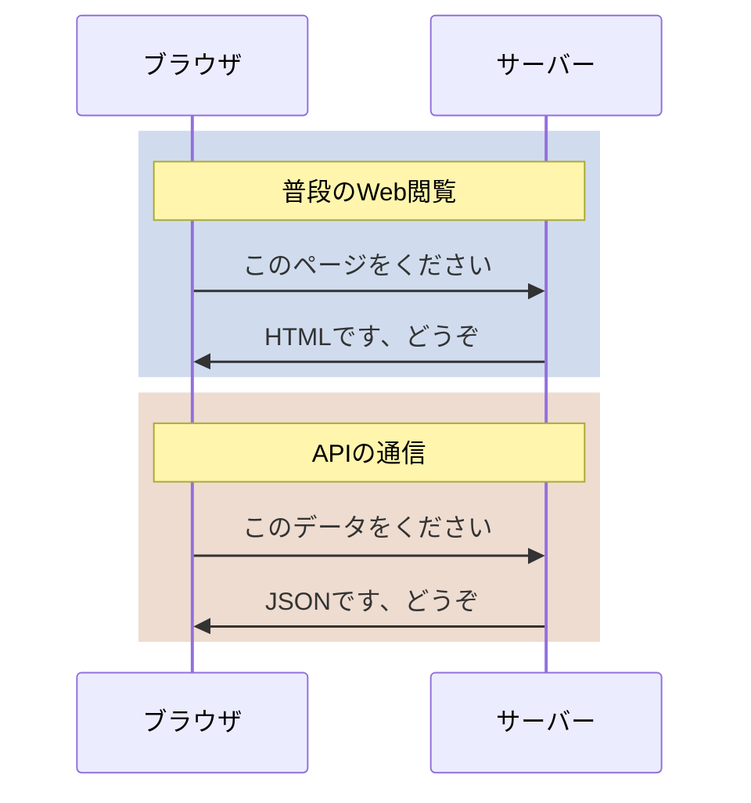
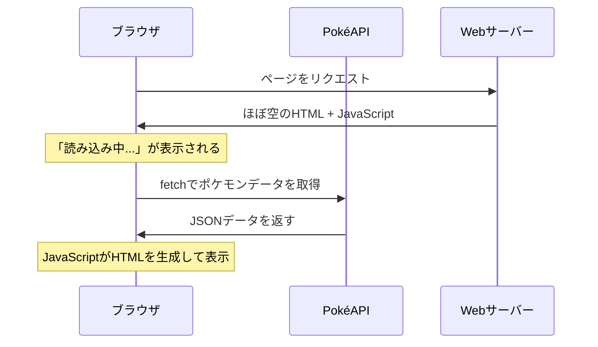
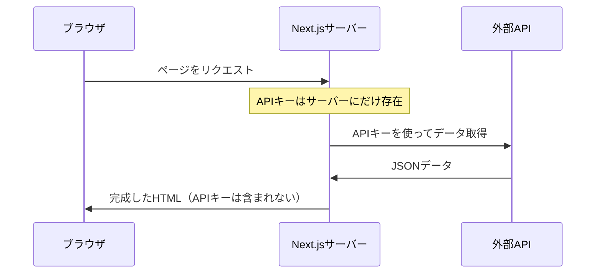

# Webアプリケーションと外部接続

フロントエンドエンジニア・マークアップエンジニア向け<br>ステップアップワークショップ 第五回

---

## 前回のおさらい

---

- HTMLレンダリングとは「HTMLを生成する行為」のこと
- **いつ・どこで**HTMLが生成されるかで、3つの手法に分かれる
  - **SSG**: ビルド時に開発者のPCで生成
  - **SSR**: リクエスト時にサーバーで生成
  - **CSR**: 実行時にブラウザで生成
- 現代のフレームワークはこれらをハイブリッドに組み合わせる

---

SSGではビルド時にHTMLが完成するため、<br>すべてのデータがビルド時点で確定している必要がありました。

しかし、ユーザーのリクエストに応じて<br>**外部からデータを取得**したい場合はどうでしょう？

---

今回はSSRの鍵となる<br>**「API」**（外部のデータを取得するための仕組み）について学び、<br>手始めにCSRでAPIを使う方法とその課題を理解します。

---

## 目次

1. APIとは何か
2. CSRでAPIを使ってみる
3. CSRと外部データ — なぜSSRが必要になるのか
4. 演習課題

---

## 1. APIとは何か

---

**API** = Application Programming Interface

**ソフトウェア同士がデータをやり取りするための窓口**

---

### APIが生まれた背景

---

#### 初期のWeb：サーバーが全部やる時代



---

サーバーがデータベースからデータを取り出し、<br>HTMLに埋め込んで、完成したページをまるごと返す。

PHPやPerl CGIの時代。<br>**「データ」と「見た目」は一体だった。**

---

#### 背景1：Webアプリケーションの登場

2000年代後半、GmailやGoogleマップが登場。<br>ページ遷移なしでUIが変化するアプリケーション。

**問題：小さなUI変更のたびに<br>ページ全体をリロードする必要がある**

---

**従来：** サーバーが完成したHTMLを返す

**発想の転換：** サーバーは**データだけ**を返し、<br>表示はブラウザに任せる

この「データだけを返す窓口」が**API**。

ブラウザ側でJavaScriptがAPIからデータを取得し、<br>HTMLを組み立てて表示する。<br>これが前回学んだ[**CSR**](https://zenn.dev/hrkd/books/cea5b9b7709ab1/viewer/b446d7#csr%EF%BC%88client-side-rendering%EF%BC%89)。

---

#### 背景2：モバイルアプリの普及

2010年代、スマートフォンの普及で<br>同じデータを複数の画面から使いたいニーズが増加。

---



**APIを1つ作れば、どのクライアントからでも同じデータを使える。**

---

#### まとめ：APIはなぜ生まれたか

| 時代 | 課題 | 解決策 |
|------|------|--------|
| 初期のWeb | データと見た目が一体 | — |
| Webアプリ時代 | 部分的なUI更新にページ全体の再読み込みが必要 | API + CSR |
| モバイル時代 | 複数のクライアントに同じデータを提供したい | 1つのAPIを共有 |

---

### APIの用途

大きく3つの用途に分けられます。

---

#### 1. 自社サービス内のフロントエンド⇔バックエンド通信

最も基本的な用途。



商品一覧を取得する、カートに追加する、注文を確定する<br>——すべてAPIを通じたデータのやり取り。

---

#### 2. 外部サービス連携

自分たちで作らずに、他社のサービスをAPIで利用するケース。

| サービス | APIでできること |
|---------|--------------|
| Stripe | クレジットカード決済 |
| Google Maps | 地図の表示、住所検索 |
| Auth0 / Firebase Auth | ユーザー認証 |
| SendGrid | メール送信 |
| Slack | メッセージ投稿、通知 |

---

「決済システムを自分で作る」のは現実的ではない。

**APIを通じて専門サービスの機能を借りる**のが<br>現代の開発スタイル。

---

#### 3. 公開API（サードパーティAPI）

自社のデータや機能を、外部の開発者に公開するAPI。

| サービス | 公開API |
|---------|--------|
| Twitter/X | ツイートの取得・投稿 |
| GitHub | リポジトリ情報の取得 |
| YouTube | 動画情報の取得 |
| PokéAPI | ポケモンデータの取得 |


---

### APIの技術的な仕組み

1. REST API
2. JSON

---

#### REST API

現在最も広く使われているAPIの設計スタイル。

APIの通信はWebサイトの閲覧と同じ**HTTP**を使う。



---

基本的な考え方は<br>「**URLがデータ（リソース）を表す**」

```
GET /api/v2/pokemon          → ポケモン一覧
GET /api/v2/pokemon/25       → 25番のポケモン（ピカチュウ）
GET /api/v2/type/electric    → でんきタイプの情報
```

---

#### HTTPメソッド

| メソッド | 操作 | 例 |
|---------|------|-----|
| **GET** | 取得する | 商品情報を取得 |
| **POST** | 新しく作る | 新しい注文を作成 |
| **PUT** | 更新する | ユーザー情報を更新 |
| **DELETE** | 削除する | カートから商品を削除 |


---

#### JSON（JavaScript Object Notation）

APIがデータを返すときの形式は、ほとんどの場合**JSON**。

```json
{
  "id": 25,
  "name": "pikachu",
  "height": 4,
  "weight": 60,
  "types": [
    { "type": { "name": "electric" } }
  ]
}
```

JavaScriptのオブジェクトとほぼ同じ構文。<br>人間にも読みやすく、プログラムでも扱いやすい。

---

### PokéAPIを触ってみる

---

#### ブラウザで叩いてみる

ブラウザのアドレスバーに入力してみましょう。

```
https://pokeapi.co/api/v2/pokemon/25
```

JSONデータが表示されます。<br>普段HTMLが返ってくるところに、データ（JSON）が返ってきた。

---

#### JavaScriptで叩いてみる

ブラウザの開発者ツール（F12）のConsoleで実行：

```javascript
const response = await fetch('https://pokeapi.co/api/v2/pokemon/25');
const data = await response.json();

console.log(data.name);    // "pikachu"
console.log(data.height);  // 4
console.log(data.types[0].type.name); // "electric"
```

`fetch` はブラウザに組み込まれたAPI通信の関数。

---

#### PokéAPIの主なエンドポイント

「エンドポイント」とは、APIの各URLのこと。<br>それぞれのURLが異なるデータを返す。

| URL | 返ってくるデータ |
|-----|---------------|
| `/api/v2/pokemon` | ポケモン一覧（20件ずつ） |
| `/api/v2/pokemon/{id or name}` | ポケモン詳細 |
| `/api/v2/type` | タイプ一覧 |
| `/api/v2/type/{id or name}` | タイプ詳細 |

---

## 2. CSRでAPIを使ってみる

---

React + PokéAPIで<br>ポケモン図鑑をCSRで作ってみましょう。

[デモ](./demo/index.html)

---

### コードの動き



---

1. ブラウザはまず「読み込み中...」と表示されたHTMLを受け取る
2. JavaScriptが実行され、**ブラウザから**PokéAPIにリクエスト
3. データを受け取り、JavaScriptがHTMLを組み立てて表示

---

### ポイント

ブラウザの開発者ツールのネットワークタブを開くと、<br>**PokéAPIへのリクエストが見える**。

ユーザー（＝ブラウザ）が直接APIと通信している。

---

## 3. CSRと外部データでは補えないポイント


---

PokéAPIのような**公開API**を叩くだけなら、<br>CSRで十分。

しかし、実際のWebサービスでは<br>CSRが外部データとのやり取りに**適さないケース**がある。

---

### 問題1：機密情報をブラウザに渡せない

---

多くのAPIは**APIキー**（認証用の秘密の文字列）が必要。

```javascript
// CSRの場合
const response = await fetch('https://api.example.com/data', {
  headers: {
    'Authorization': 'Bearer sk-1234567890abcdef'
    // ↑ 秘密の鍵
  }
});
```

---

CSRではすべてのコードがブラウザで実行される。

開発者ツールを開けば<br>**誰でもAPIキーを見ることができてしまう。**

APIキー、DB接続情報、社内システムのURL……<br>ブラウザに渡してはいけない情報はCSRでは扱えない。<br>
<br>（StripeのAPIキーが第三者に渡れば、最悪購入者の情報を漏洩することに、、、）

---

#### SSRならどうなるか



---

SSRでは、APIキーを使った通信は<br>**サーバー上で完結**する。

ブラウザにはAPIキーが渡らないので安全。

---

### 問題2：SEO

検索エンジンにコンテンツが見えない

---

CSRで作ったページのHTMLソース：

```html
<html>
  <body>
    <div id="root"><p class="p-8">読み込み中...</p></div>
	...
  </body>
</html>
```

中身はほぼ空。<br>ポケモンのデータはJavaScript実行**後**に初めて表示される。

---

**CSR：** <br>クローラーが受け取るHTML → <br>`<div id="root">読み込み中...</div>` → コンテンツが見えない

**SSR：** <br>クローラーが受け取るHTML → <br>`<h1>ピカチュウ</h1><p>でんきタイプ...</p>` → コンテンツが見える


また、SNSのOGPクローラー（Twitter、Facebook）も<br>JavaScriptを実行しない。

**検索エンジンにインデックスされたいページ**には<br>SSRが必要。

---

### CSRとSSRの使い分け

| | CSR | SSR |
|---|---|---|
| APIとの通信 | ブラウザが直接行う | サーバーが代行する |
| 機密情報 | ブラウザに露出する | サーバーに留まる |
| SEO | クローラーにコンテンツが見えない | 完成したHTMLが返る |

---

#### CSRが向いているケース

- ログイン後の画面（SEO不要）
- リアルタイムに変化するUI（チャット、ダッシュボード）
- 公開APIのみ使用し、機密情報が不要

---

#### SSRが必要なケース

- APIキーやDB接続情報など機密情報を使う
- 検索エンジンにインデックスされたいページ
- SNSでシェアしたときにプレビューを表示したい（OGP）

---

SSRはCSRの上位互換ではなく、<br>**それぞれに得意な領域がある。**

---

## 4. 演習課題

---

### 課題1：CSR版ポケモン図鑑の拡張

- 表示数を20件から**151件**（初代ポケモン全種）に変更する
- ポケモンをクリックすると**詳細情報**（タイプ、高さ、重さ）を表示する

ヒント：`useState` で選択中のポケモンを管理し、<br>クリック時に `/api/v2/pokemon/{id}` を叩いて詳細を取得。

---


## まとめ

---

- **API**はソフトウェア同士がデータをやり取りするための窓口
  - Webアプリの進化とモバイルの普及により不可欠になった
  - REST APIではURLがデータを表し、JSONでデータを返す
- **CSR**ではブラウザがAPIを叩いてHTMLを生成する
  - 公開APIを使う場合はCSRで十分
- **CSRは外部データとのやり取りに適さないケースがある**
  - **機密性**：APIキーやDB接続情報をブラウザに渡せない
  - **SEO**：検索エンジンやOGPクローラーにコンテンツを見せられない

---

## 次回予告

第六回：Webアプリケーションと外部接続 2

APIの説明ができたところで、やっとSSRをNext.jsを使って実践します。<br>さらにデータベースとの連携にも挑戦します。
