# Next.jsを用いたWebアプリケーション 1

## 前回のおさらい

前回は「HTMLレンダリング」について学びました。

- HTMLレンダリングとは「HTMLを生成する行為」のこと
- **いつ・どこで**HTMLが生成されるかで、3つの手法に分かれる
  - **SSG**: ビルド時に開発者のPCで生成
  - **SSR**: リクエスト時にサーバーで生成
  - **CSR**: 実行時にブラウザで生成
- 現代のフレームワークはこれらをハイブリッドに組み合わせる

前回の演習ではAstroを使ってSSGを体験しました。SSGではビルド時にHTMLが完成するため、すべてのデータがビルド時点で確定している必要がありました。

しかし、ユーザーのリクエストに応じて外部からデータを取得し、その結果をHTMLに反映したい場合はどうでしょう？ビルド時には存在しないデータを表示する必要があります。これが**SSR**の出番です。

今回はまず、SSRの鍵となる「API」（外部のデータを取得するための仕組み）について学び、Next.jsを使ってSSRを実践します。

---

## 目次

1. APIとは何か
   - APIが生まれた背景
   - APIの用途
   - 技術的な仕組み（HTTP、REST、JSON）
   - PokéAPIを触ってみる
2. CSRでAPIを使ってみる
3. CSRと外部データ — なぜSSRが必要になるのか
4. Next.jsでSSRを実装する
5. 演習課題

---

## 1. APIとは何か

APIは**Application Programming Interface**（アプリケーション・プログラミング・インターフェース）の略です。直訳すると「アプリケーションがプログラムを通じてやり取りするための接点」——つまり、**ソフトウェア同士がデータをやり取りするための窓口**のことです。

### APIが生まれた背景

#### 初期のWeb：サーバーが全部やる時代

1990年代〜2000年代初頭のWebサイトは、シンプルな構造でした。

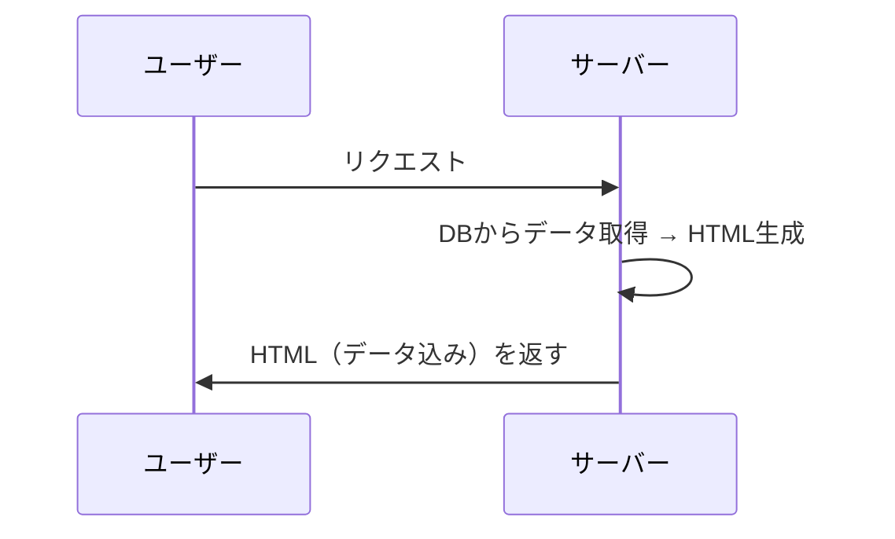

サーバーがデータベースからデータを取り出し、HTMLに埋め込んで、完成したページをまるごと返していました。PHPやPerl CGIの時代です。

```php
<?php
// サーバーがすべてを担当
$products = $db->query("SELECT * FROM products");
?>
<html>
  <body>
    <?php foreach ($products as $product): ?>
      <div><?php echo $product->name; ?></div>
    <?php endforeach; ?>
  </body>
</html>
```

この時代、「データ」と「見た目」は一体でした。サーバーが返すのは常にHTMLです。

#### Webアプリケーションの登場：フロントとバックの分離

2000年代後半、GmailやGoogleマップのようなWebアプリケーションが登場しました。これらはページ遷移なしでUIが変化します。

ここで問題が起きます。**ページ全体をHTMLで返していたら、小さなUI変更のたびにページ全体をリロードする必要がある**のです。

そこで発想が変わりました。

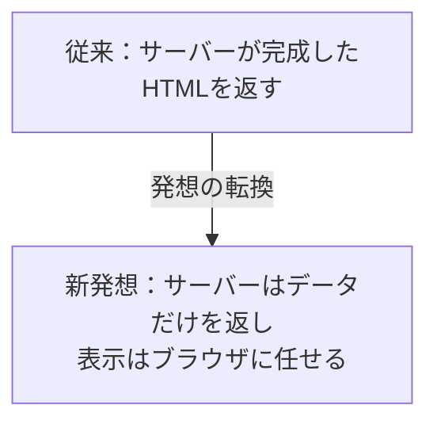

この「データだけを返す窓口」が**API**です。そしてブラウザ側でJavaScriptがAPIからデータを取得し、HTMLを組み立てて表示する——これが前回学んだ**CSR**です。CSRの普及により、ブラウザからAPIを叩くスタイルが一般的になりました。

#### モバイルアプリの普及：同じデータ、複数の画面

2010年代、スマートフォンの普及でさらにAPIの重要性が増しました。

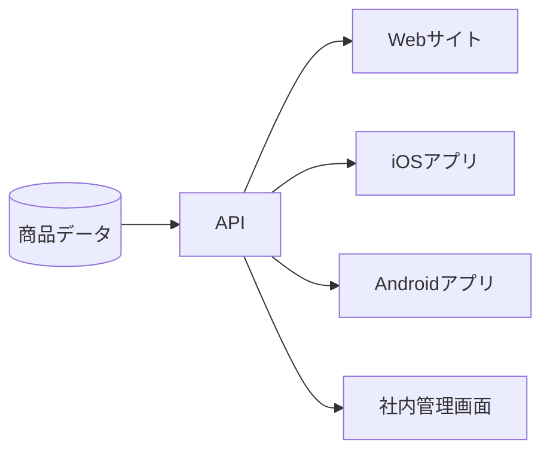

画面（クライアント）ごとにサーバーを作るのは非効率です。**データを返すAPIを1つ作れば、どのクライアントからでも同じデータを使える**——これがAPIの最大の利点です。

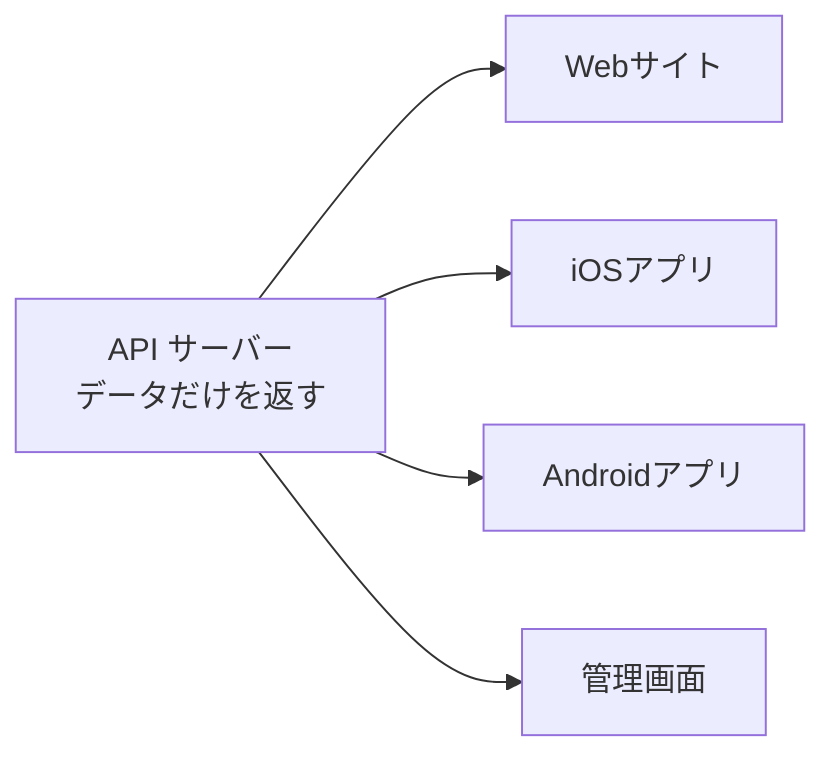

#### まとめ：APIはなぜ生まれたか

| 時代 | 課題 | 解決策 |
|------|------|--------|
| 初期のWeb | データと見た目が一体で柔軟性がない | — |
| Webアプリ時代 | 部分的なUI更新にページ全体の再読み込みが必要 | データだけを返すAPI + CSRの登場 |
| モバイル時代 | 複数のクライアントに同じデータを提供したい | 1つのAPIを共有する設計 |

---

### APIの用途

APIは今や至るところで使われています。大きく3つの用途に分けられます。

#### 1. 自社サービス内のフロント⇔バック通信

最も基本的な用途です。フロントエンドとバックエンドの間のデータのやり取りに使います。

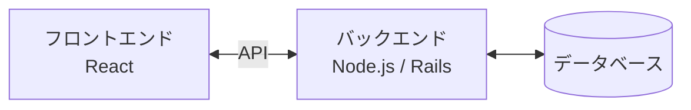

- 商品一覧を取得する
- カートに商品を追加する
- 注文を確定する

これらはすべてAPIを通じたデータのやり取りです。

#### 2. 外部サービス連携

自分たちで作らずに、他社のサービスをAPIで利用するケースです。

| サービス | APIでできること |
|---------|--------------|
| Stripe | クレジットカード決済 |
| Google Maps | 地図の表示、住所検索 |
| Auth0 / Firebase Auth | ユーザー認証 |
| SendGrid | メール送信 |
| Slack | メッセージ投稿、通知 |

「決済システムを自分で作る」のは現実的ではありません。APIを通じて専門サービスの機能を借りるのが現代の開発です。

#### 3. 公開API（サードパーティAPI）

自社のデータや機能を、外部の開発者に公開するAPIです。

| サービス | 公開API |
|---------|--------|
| Twitter/X | ツイートの取得・投稿 |
| GitHub | リポジトリ情報の取得 |
| YouTube | 動画情報の取得 |
| PokéAPI | ポケモンデータの取得 |

今回のワークショップで使う**PokéAPI**はこのカテゴリです。ポケモンのデータを誰でも無料で取得できるAPIとして公開されています。

---

### 技術的な仕組み

#### HTTP リクエスト/レスポンス

APIの通信は、普段ブラウザでWebサイトを見ている仕組みと同じ**HTTP**を使います。

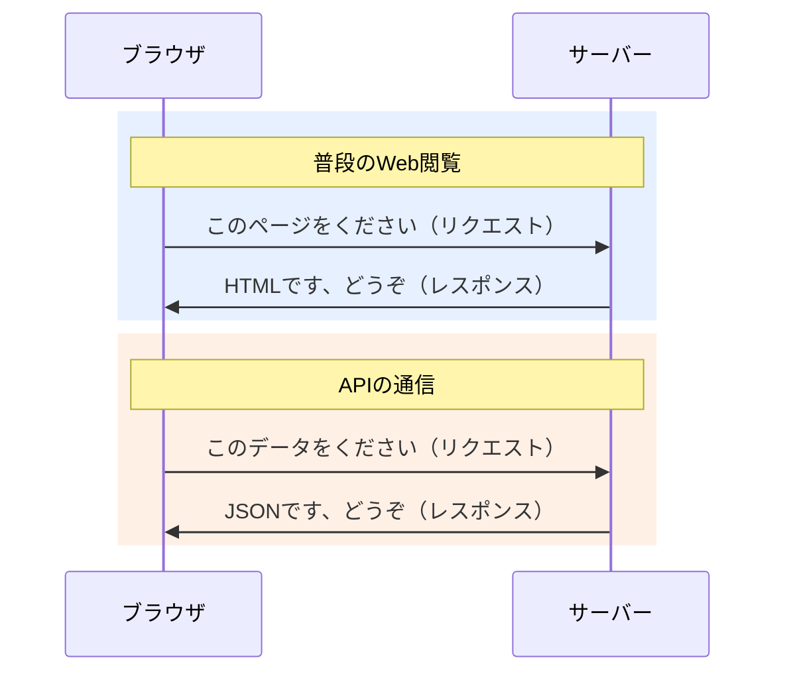

違いは**返ってくるものがHTMLではなくJSON（データ）**という点だけです。

#### REST API

現在最も広く使われているAPIの設計スタイルが**REST**（Representational State Transfer）です。

RESTの基本的な考え方は「**URLがデータ（リソース）を表す**」というものです。

```
GET https://pokeapi.co/api/v2/pokemon          → ポケモン一覧
GET https://pokeapi.co/api/v2/pokemon/25        → 25番のポケモン（ピカチュウ）
GET https://pokeapi.co/api/v2/pokemon/pikachu   → ピカチュウ（名前でも取得可）
GET https://pokeapi.co/api/v2/type/electric     → でんきタイプの情報
```

URLを見るだけで「何のデータを取得しようとしているか」が分かります。これがRESTの分かりやすさです。

##### HTTPメソッド

データに対する操作は、**HTTPメソッド**で表現します。

| メソッド | 操作 | 例 |
|---------|------|-----|
| **GET** | 取得する | 商品情報を取得 |
| **POST** | 新しく作る | 新しい注文を作成 |
| **PUT** | 更新する | ユーザー情報を更新 |
| **DELETE** | 削除する | カートから商品を削除 |

今回のワークショップではデータの取得のみなので、**GET**だけ使います。

#### JSON

APIがデータを返すときの形式は、ほとんどの場合**JSON**（JavaScript Object Notation）です。

```json
{
  "id": 25,
  "name": "pikachu",
  "height": 4,
  "weight": 60,
  "types": [
    {
      "type": {
        "name": "electric"
      }
    }
  ]
}
```

JSONはJavaScriptのオブジェクトとほぼ同じ構文で、人間にも読みやすく、プログラムでも扱いやすい形式です。

HTMLとの対比で考えると分かりやすいでしょう。

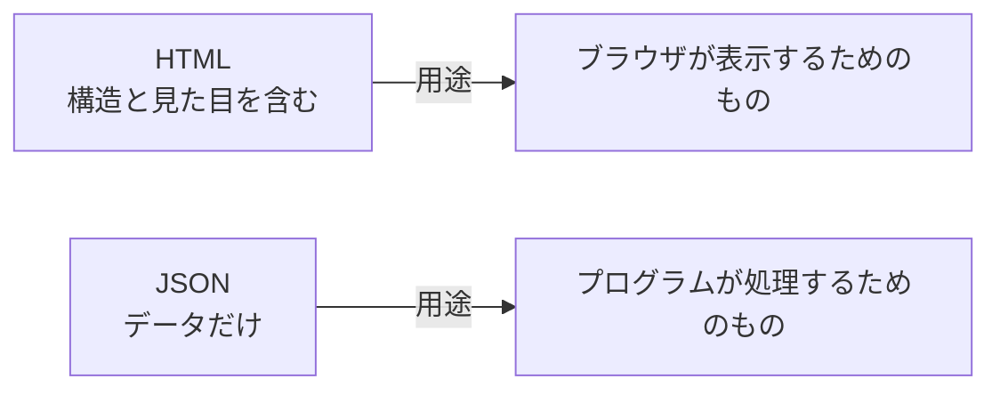

---

### PokéAPIを触ってみる

理論はここまでにして、実際にAPIを触ってみましょう。

#### ブラウザで叩いてみる

APIはブラウザのアドレスバーからでも叩けます。以下のURLをブラウザに入力してみてください。

```
https://pokeapi.co/api/v2/pokemon/25
```

JSONデータが表示されます。これがAPIのレスポンスです。普段HTMLが返ってくるところに、データ（JSON）が返ってきました。

#### JavaScriptで叩いてみる

ブラウザの開発者ツール（F12）のConsoleタブで、以下のコードを実行してみましょう。

```javascript
// ピカチュウのデータを取得
const response = await fetch('https://pokeapi.co/api/v2/pokemon/25');
const data = await response.json();

console.log(data.name);    // "pikachu"
console.log(data.height);  // 4
console.log(data.weight);  // 60
console.log(data.types[0].type.name); // "electric"
```

`fetch` はブラウザに組み込まれたAPI通信の関数です。URLを指定してデータを取得し、JSONとして解析しています。

#### PokéAPIの主なエンドポイント

| URL | 返ってくるデータ |
|-----|---------------|
| `/api/v2/pokemon` | ポケモン一覧（20件ずつ） |
| `/api/v2/pokemon/{id or name}` | ポケモン詳細 |
| `/api/v2/type` | タイプ一覧 |
| `/api/v2/type/{id or name}` | タイプ詳細（そのタイプのポケモン一覧含む） |

「エンドポイント」とは、APIの各URLのことです。それぞれのURLが異なるデータを返します。

---

## 2. CSRでAPIを使ってみる

APIの仕組みがわかったところで、まずは**CSR**でポケモンのデータを表示してみましょう。前回学んだCSRの復習です。

以下のHTMLファイルをブラウザで開いてみてください。

```html
<!DOCTYPE html>
<html>
<head>
  <meta charset="UTF-8">
  <title>ポケモン図鑑（CSR版）</title>
</head>
<body>
  <h1>ポケモン図鑑</h1>
  <div id="app">読み込み中...</div>

  <script>
    async function loadPokemon() {
      const response = await fetch('https://pokeapi.co/api/v2/pokemon?limit=20');
      const data = await response.json();

      const html = data.results.map((pokemon, index) => {
        const id = index + 1;
        return `
          <div style="display:inline-block; text-align:center; margin:8px; padding:16px; border:1px solid #ddd; border-radius:8px;">
            
            <p>No.${id}</p>
            <p><strong>${pokemon.name}</strong></p>
          </div>
        `;
      }).join('');

      document.getElementById('app').innerHTML = html;
    }

    loadPokemon();
  </script>
</body>
</html>
```

#### このコードの動き

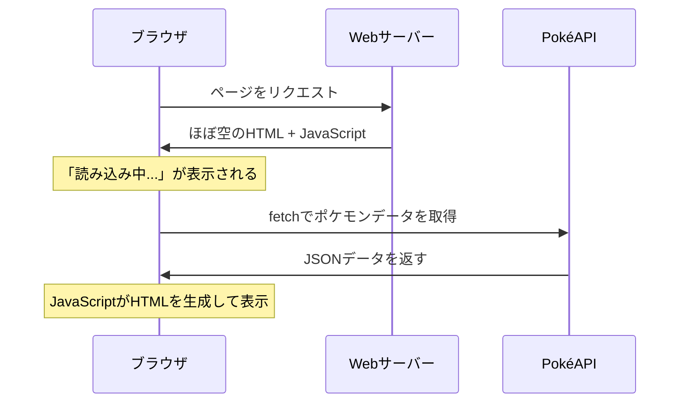

1. ブラウザはまず「読み込み中...」と表示されたHTMLを受け取る
2. JavaScriptが実行され、**ブラウザから**PokéAPIにリクエストを送る
3. データを受け取り、JavaScriptがHTMLを組み立てて画面に表示する

これがCSRです。**ブラウザ（クライアント）がAPIを叩き、HTMLを生成している**。

ここで重要なのは、ブラウザの開発者ツールのネットワークタブを開くと、**PokéAPIへのリクエストが見える**という点です。つまり、ユーザー（＝ブラウザ）が直接APIと通信しています。

---

## 3. CSRと外部データ — なぜSSRが必要になるのか

CSRでポケモン図鑑を作れました。PokéAPIのような公開APIを叩くだけなら、CSRで十分です。

しかし、実際のWebサービス開発では外部のAPIやデータベースとやり取りする場面が増えます。CSRは外部データとのやり取りに適さないケースがあるのです。SSRが上位互換というわけではなく、それぞれに得意な領域があります。

### 問題1：機密情報をブラウザに渡せない

多くのAPIは**APIキー**（認証用の秘密の文字列）が必要です。

```javascript
// CSRの場合：APIキーがブラウザ上のJavaScriptに含まれる
const response = await fetch('https://api.example.com/data', {
  headers: {
    'Authorization': 'Bearer sk-1234567890abcdef'  // ← 秘密の鍵
  }
});
```

CSRではすべてのコードがブラウザで実行されます。つまり、開発者ツールを開けば**誰でもAPIキーを見ることができてしまう**のです。

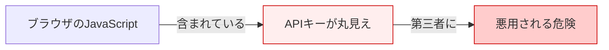

APIキーだけでなく、データベースの接続情報や、社内システムのURLなども同様です。ブラウザに渡してはいけない情報は、CSRでは扱えません。

#### SSRならどうなるか

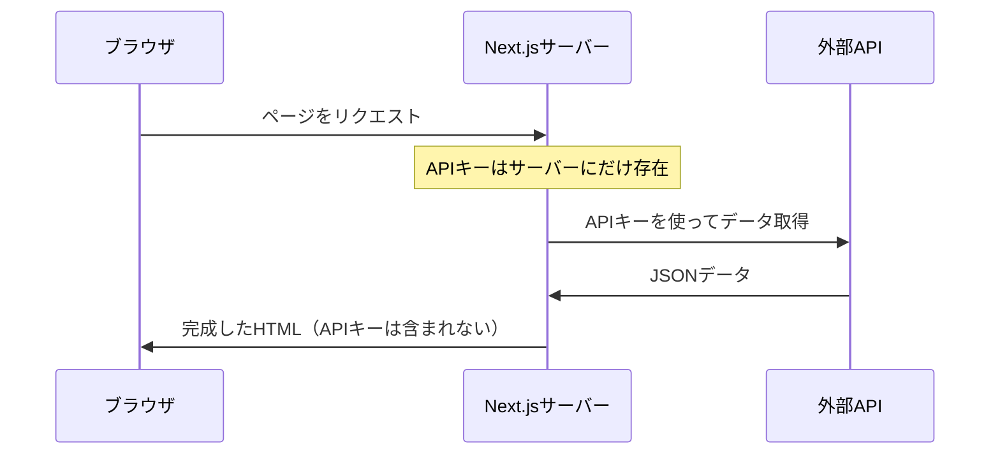

SSRでは、APIキーを使った通信はサーバー上で完結します。ブラウザにはAPIキーが渡らないので安全です。

### 問題2：SEO — 検索エンジンにコンテンツが見えない

CSRで作ったページのHTMLソースを見てみましょう。

```html
<!-- CSR：サーバーが返すHTML -->
<html>
  <body>
    <div id="app">読み込み中...</div>
    <script src="/app.js"></script>
  </body>
</html>
```

中身はほぼ空です。ポケモンのデータは、JavaScriptが実行された**後**に初めて表示されます。

Googleの検索クローラーはJavaScriptをある程度実行できますが、すべてのクローラーがそうとは限りません。SNSのOGPクローラー（TwitterやFacebookがリンクプレビューを生成するプログラム）はJavaScriptを実行しません。

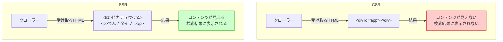

ECサイトの商品ページ、ブログ記事、企業のサービスページなど、**検索エンジンにインデックスされたいページ**にはSSRが必要です。

### まとめ：CSRとSSRの使い分け

| | CSR | SSR |
|---|---|---|
| APIとの通信 | ブラウザが直接行う | サーバーが代行する |
| 機密情報 | ブラウザに露出する | サーバーに留まる |
| SEO | クローラーにコンテンツが見えない | 完成したHTMLが返る |
| 適したケース | ログイン後の管理画面、ダッシュボード | 公開ページ、SEOが必要なページ |

**CSRが向いているケース：**
- ログイン後の画面（SEO不要）
- リアルタイムに変化するUI（チャット、ダッシュボード）
- 公開APIのみ使用し、機密情報が不要

**SSRが必要なケース：**
- APIキーやDB接続情報など機密情報を使う
- 検索エンジンにインデックスされたいページ
- SNSでシェアしたときにプレビューを表示したい（OGP）

---

## 4. Next.jsでSSRを実装する

CSRが外部データのやり取りに適さないケースがわかったところで、Next.jsを使ってSSRを実装してみましょう。

### Next.jsとは

Next.jsはReactベースのフレームワークで、**SSR・SSG・CSRをページごとに使い分けられる**のが特徴です。前回学んだレンダリング手法をすべてカバーしています。

### プロジェクトの作成

```bash
# Next.jsプロジェクトを作成
npx create-next-app@latest pokemon-app

# 設問には以下のように回答
# ✔ Would you like to use TypeScript? → No
# ✔ Would you like to use ESLint? → Yes
# ✔ Would you like to use Tailwind CSS? → Yes
# ✔ Would you like your code inside a `src/` directory? → No
# ✔ Would you like to use App Router? → Yes
# ✔ Would you like to use Turbopack for next dev? → Yes
# ✔ Would you like to customize the import alias? → No

# プロジェクトに移動
cd pokemon-app

# 開発サーバーを起動
npm run dev
```

ブラウザで `http://localhost:3000` にアクセスすると、Next.jsの初期画面が表示されます。

### ディレクトリ構成

```
pokemon-app/
├── app/
│   ├── layout.js      ← 全ページ共通のレイアウト
│   ├── page.js        ← トップページ（ / ）
│   └── globals.css    ← グローバルCSS
├── public/            ← 静的ファイル（画像など）
├── package.json
└── next.config.mjs
```

Next.jsの**App Router**では、`app/` フォルダの中のファイル構造がそのままURLに対応します。

```
app/page.js           → /
app/about/page.js     → /about
app/pokemon/page.js   → /pokemon
app/pokemon/[id]/page.js → /pokemon/1, /pokemon/25, ...
```

### ポケモン一覧ページの実装

`app/page.js` を以下の内容に置き換えます。

```jsx
// app/page.js

export default async function Home() {
  // サーバーでPokéAPIからデータを取得
  const response = await fetch('https://pokeapi.co/api/v2/pokemon?limit=20');
  const data = await response.json();

  return (
    <main className="p-8">
      <h1 className="text-2xl font-bold">ポケモン図鑑</h1>
      <div className="grid grid-cols-4 gap-4 mt-4">
        {data.results.map((pokemon, index) => {
          const id = index + 1;
          return (
            <a
              key={pokemon.name}
              href={`/pokemon/${id}`}
              className="border border-gray-300 rounded-lg p-4 text-center no-underline text-inherit hover:bg-gray-50"
            >
              
              <p>No.{id}</p>
              <p className="font-bold capitalize">{pokemon.name}</p>
            </a>
          );
        })}
      </div>
    </main>
  );
}
```

#### CSR版との違いに注目

先ほどのCSR版と見比べてみましょう。

| | CSR版 | Next.js（SSR）版 |
|---|---|---|
| `fetch` の実行場所 | ブラウザ | サーバー |
| データ取得のタイミング | ページ表示後 | ページ表示前 |
| 「読み込み中...」の表示 | ある | ない |
| HTMLソース | 空 | データ入り |

Next.jsのサーバーコンポーネント（`async function`）では、`fetch` は**サーバー上で実行**されます。つまり：

```
1. ユーザーがページにアクセス
2. Next.jsのサーバーがPokéAPIにリクエスト（サーバー上で実行）
3. 取得したデータでHTMLを生成
4. 完成したHTMLをユーザーに返す
```

ブラウザのネットワークタブを見ても、PokéAPIへのリクエストは見えません。**すべてサーバー上で完結している**からです。

### ポケモン詳細ページの実装

URLの一部をパラメータとして受け取る「動的ルーティング」を使います。

```bash
# ディレクトリを作成
mkdir -p app/pokemon/[id]
```

`app/pokemon/[id]/page.js` を作成します。

```jsx
// app/pokemon/[id]/page.js

export default async function PokemonDetail({ params }) {
  const { id } = await params;

  // サーバーでPokéAPIからデータを取得
  const response = await fetch(`https://pokeapi.co/api/v2/pokemon/${id}`);
  const pokemon = await response.json();

  return (
    <main className="p-8 max-w-xl mx-auto">
      <a href="/" className="text-blue-600 hover:underline">← 一覧に戻る</a>

      <div className="text-center mt-4">
        
        <h1 className="text-2xl font-bold capitalize mt-2">
          No.{pokemon.id} {pokemon.name}
        </h1>
      </div>

      <table className="w-full border-collapse mt-4">
        <tbody>
          <tr className="border-b border-gray-300">
            <th className="p-2 text-left">タイプ</th>
            <td className="p-2">
              {pokemon.types.map(t => t.type.name).join(', ')}
            </td>
          </tr>
          <tr className="border-b border-gray-300">
            <th className="p-2 text-left">高さ</th>
            <td className="p-2">{pokemon.height / 10} m</td>
          </tr>
          <tr className="border-b border-gray-300">
            <th className="p-2 text-left">重さ</th>
            <td className="p-2">{pokemon.weight / 10} kg</td>
          </tr>
          <tr className="border-b border-gray-300">
            <th className="p-2 text-left">基本経験値</th>
            <td className="p-2">{pokemon.base_experience}</td>
          </tr>
        </tbody>
      </table>

      <h2 className="text-xl font-bold mt-6">ステータス</h2>
      <div className="mt-2">
        {pokemon.stats.map(stat => (
          <div key={stat.stat.name} className="mb-2">
            <div className="flex justify-between mb-1">
              <span className="capitalize">{stat.stat.name}</span>
              <span>{stat.base_stat}</span>
            </div>
            <div className="bg-gray-200 rounded h-2">
              <div
                className="bg-green-500 rounded h-full"
                style={{ width: `${Math.min(stat.base_stat / 255 * 100, 100)}%` }}
              />
            </div>
          </div>
        ))}
      </div>
    </main>
  );
}
```

### SSRであることを確認する

ブラウザで `http://localhost:3000/pokemon/25` にアクセスし、以下を確認してみましょう。

1. **ページのソースを表示**（右クリック →「ページのソースを表示」）
   - HTMLの中にポケモンの情報が含まれている → SSR
   - CSRなら `<div id="root"></div>` のような空のHTMLが返る

2. **ブラウザのネットワークタブ**
   - PokéAPIへのリクエストが**見えない** → サーバーで通信が完結

3. **「読み込み中...」が表示されない**
   - CSR版では一瞬「読み込み中...」が見えたが、SSRでは最初から完成したページが表示される

---

## 5. 演習課題

### 課題1：ポケモンの表示数を増やす

一覧ページの表示数を20件から151件（初代ポケモン全種）に変更してみましょう。

ヒント：`fetch` のURLパラメータを変更します。

### 課題2：タイプ別フィルタページの作成

`/type/[name]` というページを作り、特定のタイプのポケモン一覧を表示してみましょう。

```
/type/fire      → ほのおタイプのポケモン一覧
/type/water     → みずタイプのポケモン一覧
/type/electric  → でんきタイプのポケモン一覧
```

ヒント：`https://pokeapi.co/api/v2/type/fire` でタイプ別のポケモン一覧が取得できます。

### 課題3（発展）：OGPの設定

Next.jsの `metadata` を使って、詳細ページにOGP情報を設定してみましょう。

```jsx
// ヒント：generateMetadata関数を使う
export async function generateMetadata({ params }) {
  const { id } = await params;

  const response = await fetch(`https://pokeapi.co/api/v2/pokemon/${id}`);
  const pokemon = await response.json();

  return {
    title: `No.${pokemon.id} ${pokemon.name}`,
    description: `${pokemon.name}のステータス・タイプ情報`,
    openGraph: {
      title: `No.${pokemon.id} ${pokemon.name}`,
      images: [pokemon.sprites.other['official-artwork'].front_default],
    },
  };
}
```

ページのソースを表示して、`<meta property="og:title">` などが出力されることを確認してみてください。

---

## まとめ

- **API**はソフトウェア同士のデータのやり取りの仕組み
  - Webアプリの進化とモバイルの普及により不可欠になった
  - REST APIではURLがデータを表し、JSONでデータを返す
- **CSRは外部データとのやり取りに適さないケースがある**——それがSSRの導入動機になる
  - **機密性**：APIキーやDB接続情報をブラウザに渡せない → サーバーで処理すべき
  - **SEO**：検索エンジンやOGPクローラーにコンテンツを見せたい → 完成したHTMLを返すべき
- **Next.js**はReactベースのフレームワークで、SSR・SSG・CSRを使い分けられる
  - サーバーコンポーネントの `fetch` はサーバー上で実行される
  - ブラウザにはAPIキーもリクエストも露出しない

---

## 次回予告

第六回：Next.jsを用いたWebアプリケーション 2

今回の課題をレビューし、Next.jsの理解をさらに深めます。
