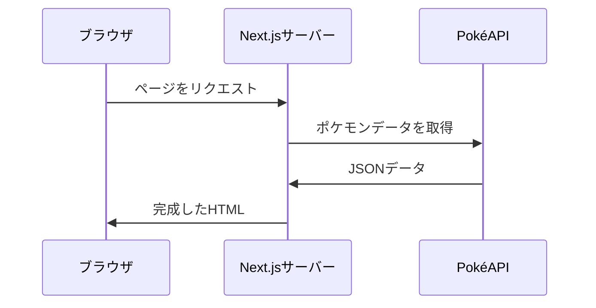
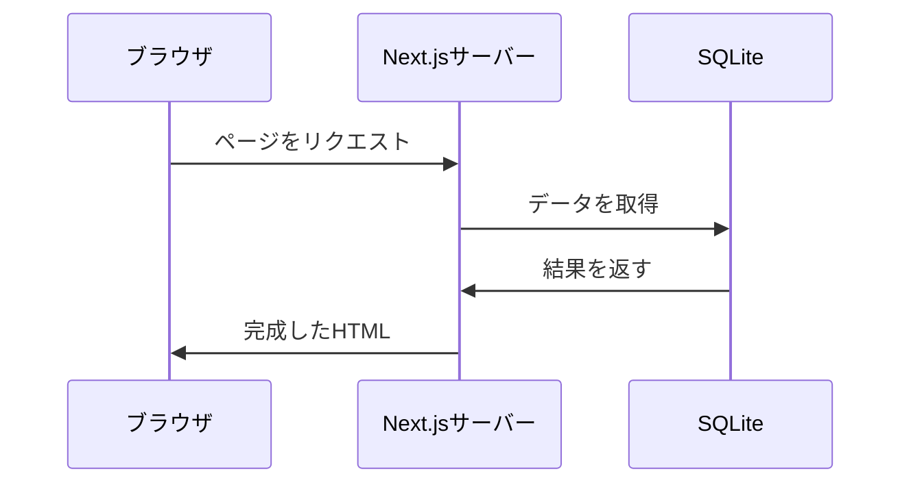

# Webアプリケーションと外部接続 2

## 前回のおさらい

前回は「API」と「CSR」について学びました。

- **API**はソフトウェア同士がデータをやり取りするための窓口
- **CSR**ではブラウザがAPIを叩いてHTMLを生成する
- CSRには外部データとのやり取りに適さないケースがある
  - **機密性**：APIキーやDB接続情報をブラウザに渡せない
  - **SEO**：検索エンジンやOGPクローラーにコンテンツを見せられない

今回はこれらの課題を解決する**SSR**を、Next.jsを使って実践します。さらに、APIだけでなく**データベース（SQLite）**との連携にも挑戦します。

---

## 目次

1. Next.jsでSSRを実装する
   - プロジェクトのセットアップ
   - ポケモン一覧ページの実装
   - ポケモン詳細ページの実装
   - SSRであることを確認する
2. SSRが活きるポイント
3. データベース連携（SQLite）
   - DBとは何か
   - Next.jsからSQLiteに接続する
4. 演習課題

---

## 1. Next.jsでSSRを実装する

CSRが外部データのやり取りに適さないケースがわかったところで、Next.jsを使ってSSRを実装してみましょう。

### Next.jsとは

Next.jsはReactベースのフレームワークで、**SSR・SSG・CSRをページごとに使い分けられる**のが特徴です。前々回学んだレンダリング手法をすべてカバーしています。

### プロジェクトの作成

```bash
# Next.jsプロジェクトを作成
npx create-next-app@latest pokemon-app

# 設問には以下のように回答
# ✔ Would you like to use TypeScript? → No
# ✔ Would you like to use ESLint? → Yes
# ✔ Would you like to use Tailwind CSS? → Yes
# ✔ Would you like your code inside a `src/` directory? → No
# ✔ Would you like to use App Router? → Yes
# ✔ Would you like to use Turbopack for next dev? → Yes
# ✔ Would you like to customize the import alias? → No

# プロジェクトに移動
cd pokemon-app

# 開発サーバーを起動
npm run dev
```

ブラウザで `http://localhost:3000` にアクセスすると、Next.jsの初期画面が表示されます。

### ディレクトリ構成

```
pokemon-app/
├── app/
│   ├── layout.js      ← 全ページ共通のレイアウト
│   ├── page.js        ← トップページ（ / ）
│   └── globals.css    ← グローバルCSS
├── public/            ← 静的ファイル（画像など）
├── package.json
└── next.config.mjs
```

Next.jsの**App Router**では、`app/` フォルダの中のファイル構造がそのままURLに対応します。

```
app/page.js           → /
app/about/page.js     → /about
app/pokemon/page.js   → /pokemon
app/pokemon/[id]/page.js → /pokemon/1, /pokemon/25, ...
```

### ポケモン一覧ページの実装

`app/page.js` を以下の内容に置き換えます。

```jsx
// app/page.js

export default async function Home() {
  // サーバーでPokéAPIからデータを取得
  const response = await fetch('https://pokeapi.co/api/v2/pokemon?limit=20');
  const data = await response.json();

  return (
    <main className="p-8">
      <h1 className="text-2xl font-bold">ポケモン図鑑</h1>
      <div className="grid grid-cols-4 gap-4 mt-4">
        {data.results.map((pokemon, index) => {
          const id = index + 1;
          return (
            <a
              key={pokemon.name}
              href={`/pokemon/${id}`}
              className="border border-gray-300 rounded-lg p-4 text-center no-underline text-inherit hover:bg-gray-50"
            >
              
              <p>No.{id}</p>
              <p className="font-bold capitalize">{pokemon.name}</p>
            </a>
          );
        })}
      </div>
    </main>
  );
}
```

#### CSR版との違いに注目

前回のCSR版と見比べてみましょう。

| | CSR版 | Next.js（SSR）版 |
|---|---|---|
| `fetch` の実行場所 | ブラウザ | サーバー |
| データ取得のタイミング | ページ表示後 | ページ表示前 |
| 「読み込み中...」の表示 | ある | ない |
| HTMLソース | 空 | データ入り |

Next.jsのサーバーコンポーネント（`async function`）では、`fetch` は**サーバー上で実行**されます。つまり：



ブラウザのネットワークタブを見ても、PokéAPIへのリクエストは見えません。**すべてサーバー上で完結している**からです。

### ポケモン詳細ページの実装

URLの一部をパラメータとして受け取る「動的ルーティング」を使います。

```bash
# ディレクトリを作成
mkdir -p app/pokemon/[id]
```

`app/pokemon/[id]/page.js` を作成します。

```jsx
// app/pokemon/[id]/page.js

export default async function PokemonDetail({ params }) {
  const { id } = await params;

  // サーバーでPokéAPIからデータを取得
  const response = await fetch(`https://pokeapi.co/api/v2/pokemon/${id}`);
  const pokemon = await response.json();

  return (
    <main className="p-8 max-w-xl mx-auto">
      <a href="/" className="text-blue-600 hover:underline">← 一覧に戻る</a>

      <div className="text-center mt-4">
        
        <h1 className="text-2xl font-bold capitalize mt-2">
          No.{pokemon.id} {pokemon.name}
        </h1>
      </div>

      <table className="w-full border-collapse mt-4">
        <tbody>
          <tr className="border-b border-gray-300">
            <th className="p-2 text-left">タイプ</th>
            <td className="p-2">
              {pokemon.types.map(t => t.type.name).join(', ')}
            </td>
          </tr>
          <tr className="border-b border-gray-300">
            <th className="p-2 text-left">高さ</th>
            <td className="p-2">{pokemon.height / 10} m</td>
          </tr>
          <tr className="border-b border-gray-300">
            <th className="p-2 text-left">重さ</th>
            <td className="p-2">{pokemon.weight / 10} kg</td>
          </tr>
          <tr className="border-b border-gray-300">
            <th className="p-2 text-left">基本経験値</th>
            <td className="p-2">{pokemon.base_experience}</td>
          </tr>
        </tbody>
      </table>

      <h2 className="text-xl font-bold mt-6">ステータス</h2>
      <div className="mt-2">
        {pokemon.stats.map(stat => (
          <div key={stat.stat.name} className="mb-2">
            <div className="flex justify-between mb-1">
              <span className="capitalize">{stat.stat.name}</span>
              <span>{stat.base_stat}</span>
            </div>
            <div className="bg-gray-200 rounded h-2">
              <div
                className="bg-green-500 rounded h-full"
                style={{ width: `${Math.min(stat.base_stat / 255 * 100, 100)}%` }}
              />
            </div>
          </div>
        ))}
      </div>
    </main>
  );
}
```

### SSRであることを確認する

ブラウザで `http://localhost:3000/pokemon/25` にアクセスし、以下を確認してみましょう。

1. **ページのソースを表示**（右クリック →「ページのソースを表示」）
   - HTMLの中にポケモンの情報が含まれている → SSR
   - CSRなら `<div id="root"></div>` のような空のHTMLが返る

2. **ブラウザのネットワークタブ**
   - PokéAPIへのリクエストが**見えない** → サーバーで通信が完結

3. **「読み込み中...」が表示されない**
   - CSR版では一瞬「読み込み中...」が見えたが、SSRでは最初から完成したページが表示される

---

## 2. SSRが活きるポイント

### 機密情報の保護

前回学んだ通り、SSRではAPIキーやDB接続情報がサーバーに留まります。ブラウザには完成したHTMLだけが返るため、機密情報が露出しません。

### SEOとOGP

SSRで返されるHTMLには最初からコンテンツが含まれているため、検索エンジンのクローラーやSNSのOGPクローラーが正しくコンテンツを認識できます。

Next.jsでは `generateMetadata` 関数を使って、ページごとに動的なOGP情報を設定できます。

```jsx
// ヒント：generateMetadata関数を使う
export async function generateMetadata({ params }) {
  const { id } = await params;

  const response = await fetch(`https://pokeapi.co/api/v2/pokemon/${id}`);
  const pokemon = await response.json();

  return {
    title: `No.${pokemon.id} ${pokemon.name}`,
    description: `${pokemon.name}のステータス・タイプ情報`,
    openGraph: {
      title: `No.${pokemon.id} ${pokemon.name}`,
      images: [pokemon.sprites.other['official-artwork'].front_default],
    },
  };
}
```

---

## 3. データベース連携（SQLite）

ここまでは外部APIとの接続を扱いました。もうひとつの重要な外部接続が**データベース（DB）**です。

### DBとは何か

APIが「他のサーバーからデータを借りてくる」仕組みだとすれば、DBは「**自分のサーバーにデータを保存して、読み書きする**」仕組みです。

| | API | DB |
|---|---|---|
| データの場所 | 他社・外部のサーバー | 自分のサーバー |
| 操作 | 主にデータの取得（GET） | 読み書き両方（CRUD） |
| 接続情報 | APIキー | DB接続文字列（ホスト、ユーザー、パスワード） |
| 例 | PokéAPI、Stripe | MySQL、PostgreSQL、SQLite |

APIで取得するデータは他社が管理していますが、DBのデータは**自分たちが管理する**ものです。ユーザー情報、投稿データ、注文履歴などがこれにあたります。

### なぜDBもSSRで扱うべきか

DB接続情報（ホスト名、パスワード等）はAPIキーと同様、**ブラウザに渡してはいけない**機密情報です。そもそもブラウザから直接DBに接続することは通常できません。DBへのアクセスは必ずサーバーを経由します。



### SQLiteとは

SQLiteはファイルベースの軽量なデータベースです。

- **サーバー不要**：DBファイル1つで動作する
- **セットアップ不要**：npmパッケージをインストールするだけ
- **SQL対応**：MySQL/PostgreSQLと同じSQLが使える

ワークショップでの学習に最適です。

### Next.jsからSQLiteに接続する

#### セットアップ

```bash
# better-sqlite3をインストール
npm install better-sqlite3
```

#### データベースの準備

プロジェクトのルートに `init-db.js` を作成し、初期データを投入します。

```javascript
// init-db.js
const Database = require('better-sqlite3');

const db = new Database('app.db');

db.exec(`
  CREATE TABLE IF NOT EXISTS bookmarks (
    id INTEGER PRIMARY KEY AUTOINCREMENT,
    pokemon_id INTEGER NOT NULL,
    pokemon_name TEXT NOT NULL,
    note TEXT,
    created_at TEXT DEFAULT (datetime('now'))
  )
`);

// サンプルデータを投入
const insert = db.prepare(
  'INSERT INTO bookmarks (pokemon_id, pokemon_name, note) VALUES (?, ?, ?)'
);

insert.run(25, 'pikachu', 'でんきタイプの代表格');
insert.run(6, 'charizard', 'かっこいいドラゴン風');
insert.run(150, 'mewtwo', '最強の伝説ポケモン');

console.log('データベースを初期化しました');
db.close();
```

```bash
# 初期化スクリプトを実行
node init-db.js
```

#### お気に入りページの実装

`app/bookmarks/page.js` を作成します。

```jsx
// app/bookmarks/page.js
import Database from 'better-sqlite3';

export const dynamic = 'force-dynamic';

export default function BookmarksPage() {
  const db = new Database('app.db');
  const bookmarks = db.prepare('SELECT * FROM bookmarks ORDER BY created_at DESC').all();
  db.close();

  return (
    <main className="p-8 max-w-xl mx-auto">
      <a href="/" className="text-blue-600 hover:underline">← 図鑑に戻る</a>
      <h1 className="text-2xl font-bold mt-4">お気に入りポケモン</h1>

      <div className="mt-4">
        {bookmarks.map(bookmark => (
          <a
            key={bookmark.id}
            href={`/pokemon/${bookmark.pokemon_id}`}
            className="flex items-center gap-4 p-4 border-b border-gray-200 hover:bg-gray-50"
          >
            
            <div>
              <p className="font-bold capitalize">{bookmark.pokemon_name}</p>
              <p className="text-gray-500 text-sm">{bookmark.note}</p>
            </div>
          </a>
        ))}
      </div>
    </main>
  );
}
```

#### ポイント

- `Database('app.db')` — SQLiteファイルに直接接続している
- この接続は**サーバー上でのみ実行**される（ブラウザにDB接続情報は渡らない）
- SQLを使ってデータを取得し、HTMLに反映してからブラウザに返す
- これもSSRの一形態：**サーバーが外部（DB）からデータを取得し、HTMLを生成して返す**

---

## 4. 演習課題

### 課題1：ポケモンの表示数を増やす

一覧ページの表示数を20件から151件（初代ポケモン全種）に変更してみましょう。

ヒント：`fetch` のURLパラメータを変更します。

### 課題2：タイプ別フィルタページの作成

`/type/[name]` というページを作り、特定のタイプのポケモン一覧を表示してみましょう。

```
/type/fire      → ほのおタイプのポケモン一覧
/type/water     → みずタイプのポケモン一覧
/type/electric  → でんきタイプのポケモン一覧
```

ヒント：`https://pokeapi.co/api/v2/type/fire` でタイプ別のポケモン一覧が取得できます。

### 課題3（発展）：お気に入り機能の完成

お気に入りページに、以下の機能を追加してみましょう。

- ポケモン詳細ページに「お気に入りに追加」ボタンを設置
- ボタンを押すとSQLiteのbookmarksテーブルにデータを追加する

ヒント：Next.jsの **Server Actions** を使うと、フォーム送信でサーバー側の処理を実行できます。

---

## まとめ

- **SSR**はサーバーが外部（API・DB）からデータを取得し、HTMLを生成して返す手法
- **Next.js**ではサーバーコンポーネントの `fetch` やDB接続がサーバー上で実行される
  - ブラウザにはAPIキーやDB接続情報は渡らない
  - 完成したHTMLが返るのでSEO・OGPに有利
- 外部接続には大きく2種類ある
  - **API**：他社・外部サーバーからデータを取得する
  - **DB**：自分のサーバーにデータを保存・取得する
- どちらもSSRで扱うことで、機密性とSEOの課題を解決できる

---

## 次回予告

第七回：大規模開発の実例

チーム編成やメンバーの役割分担など、実際のプロジェクトがどのように進むのかを学びます。
