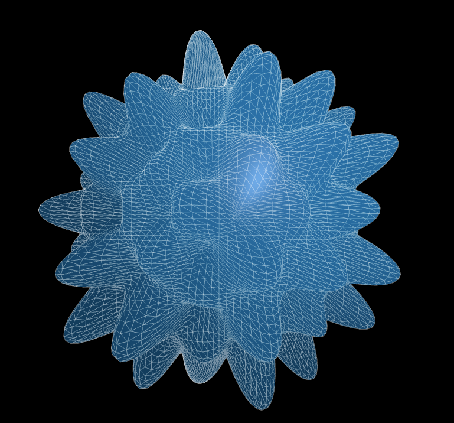
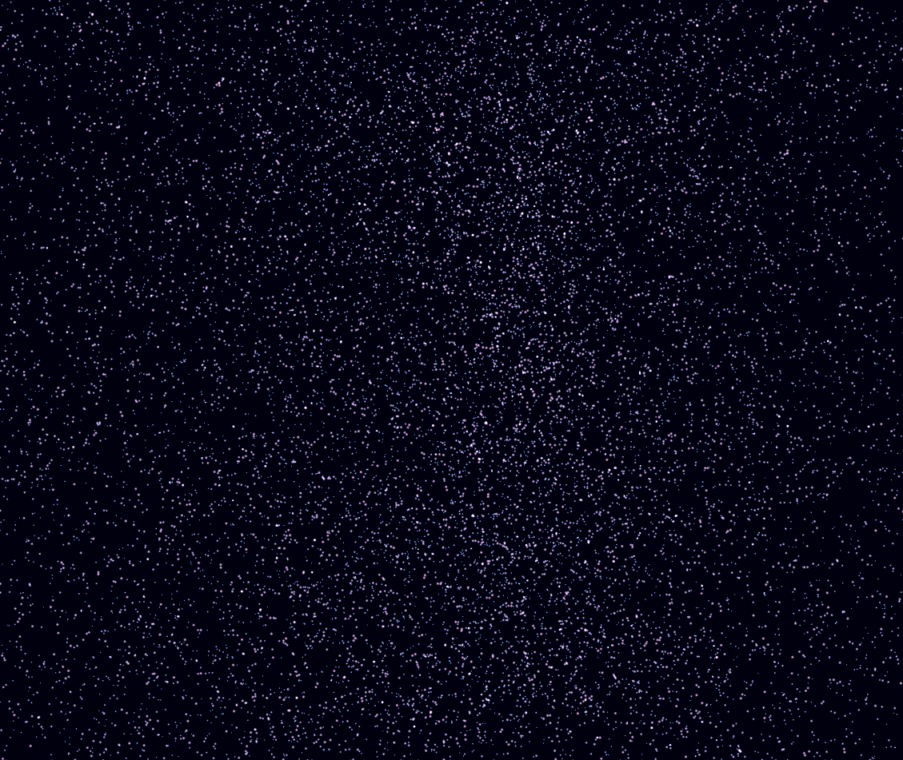
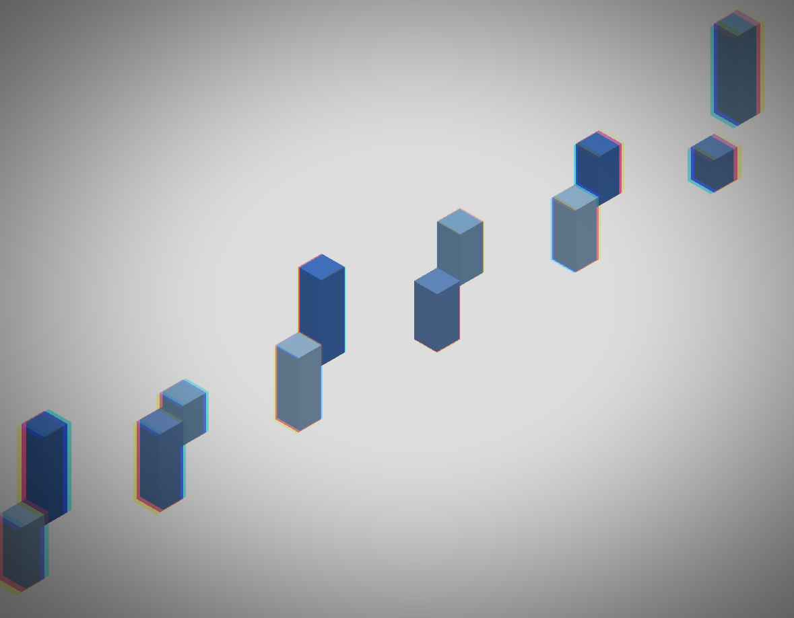
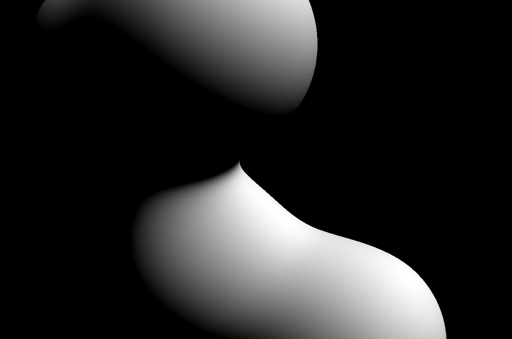

# WebGL シェーダー芸入門 — GLSL で「画」を作る

vol_09 では three.js（スリージェイエス）の登場人物（シーン／カメラ／メッシュ／レンダラー）を組み合わせて 3D 空間を描きました。今回はその描画パイプラインの **シェーダー（shader／シェーダー）** ─ ピクセルや頂点を「実際に計算している部分」 ─ を自分で書きます。

「画面のピクセル1つ1つに対して、好きな色を計算式で出力できる」。これが分かると、いままで使ってきた three.js のマテリアルが「他人が書いてくれたシェーダーをロードしていただけ」だったと見えてきます。そして自分でシェーダーを書けると、表現の幅が一段違う場所まで広がります。

---

## 0. 今回作る4つの絵

最初に、今回扱う4パターンの「完成イメージ」を並べておきます。何を作るのかを先に頭に入れて、その後で必要な部品を順番に取り出しに行きます。

### パターン1：vertex shader で図形を歪ませる



### パターン2：パーティクル（particle／粒子）



### パターン3：ポストプロセス（post process／後処理）



### パターン4：フラグメントシェーダーで「一枚絵」を描く（3D メタボール）



---

これら4つを順番に作っていきます。その前に、4つ全部を読むのに必要な「最低限の語彙」だけ先に集めておきます。

---

## 1. シェーダーの最低限の語彙

シェーダーは **GLSL（ジーエルエスエル／OpenGL Shading Language）** という C 言語風の専用言語で書きます。深入りすると一冊の本になりますが、今回必要なのは次のものだけです。

### 1.1 vertex shader と fragment shader

GPU で描画される 1 枚の絵は、必ず2種類のシェーダーを通ります。

- **vertex shader（バーテックスシェーダー／頂点シェーダー）**
    - 頂点 1 個ずつに対して走る
    - 「この頂点を画面上のどこに置くか」を決める
    - 出力：`gl_Position`（ジーエル・ポジション）
- **fragment shader（フラグメントシェーダー／断片シェーダー）**
    - 画面のピクセル 1 個ずつに対して走る
    - 「このピクセルを何色にするか」を決める
    - 出力：`gl_FragColor`（ジーエル・フラグカラー）

頂点が10万個あれば vertex shader は10万回、画面が 1920×1080 なら fragment shader は約207万回、**それぞれ完全に並列で** 走ります。「同じ計算をピクセルごとに走らせる」ことが嫌になるほど高速にできるのが GPU の真骨頂です。

### 1.2 attribute / uniform / varying

シェーダーが受け取れる値は、出どころによって3種類に分かれます。

| 種類          | 読み方       | どこから来る               | 例                                   |
| ----------- | --------- | -------------------- | ----------------------------------- |
| `attribute` | アトリビュート   | 頂点ごとに違うデータ           | 頂点座標 `position`、法線 `normal`、UV `uv` |
| `uniform`   | ユニフォーム    | JS から、全頂点・全ピクセルで共通の値 | 時間 `u_time`、解像度 `u_resolution`、行列   |
| `varying`   | バリイング     | vertex → fragment へ送る | UV 座標、頂点色、波の高さ                      |

「`attribute` は頂点ごと」「`uniform` は全部共通」「`varying` は vertex から fragment へのバケツリレー」と覚えておけば十分です。

### 1.3 three.js が裏で渡してくれているもの

three.js の `ShaderMaterial`（シェーダーマテリアル）を使うと、毎回書く定型の `uniform` や `attribute` は自動で挿入されます。

- `position`（頂点座標）、`normal`（法線）、`uv`（UV座標）はすでに `attribute` として宣言済み
- `modelMatrix` / `viewMatrix` / `projectionMatrix` などカメラ系の `uniform` も宣言済み

シェーダーの中で `position` と書けばそのまま使える、というのは three.js が裏で繋いでくれているからです。

---

これだけ持って、いよいよ4パターンに入ります。

---
## 2. パターン1：vertex shader で図形を歪ませる

### 完成イメージ


普通の球体（sphere／スフィア）を置いたのに、光が当たって陰影もちゃんと出たまま、表面がうにょうにょ動く。形そのものをアニメーションさせている状態です。

### 仕組み

vertex shader（バーテックスシェーダー）は「頂点を画面上のどこに置くか」を決めるシェーダーでした。これに `sin` などの数式を混ぜると、**頂点そのものを動かすことで形を変える** ことができます。球体の各頂点を、その座標と時間に応じて法線方向に押し出してやれば、表面が膨らんで脈打ちます。

実装は2通りあります。

- **(a) `ShaderMaterial` で vertex / fragment を両方自分で書く**：自由度は最大だが、ライトや影・反射も自分で計算する必要があり、コードが一気に膨らむ
- **(b) `MeshStandardMaterial`（メッシュスタンダードマテリアル）に `onBeforeCompile`（オンビフォアコンパイル）で頂点だけパッチする**：ライト・影・反射・トーンマッピングは three.js 側の実装をそのまま使えるので、実用上いちばん使いやすい

今回は (b) のパターンで書きます。

### 必要な構成要素

#### `position` を直接書き換えない

GLSL では `attribute`（アトリビュート）は読み取り専用なので、`position` を書き換えてはいけません。代わりに新しい変数 `transformed` を作って、それを以降の計算で使います。

```glsl
vec3 transformed = position;
transformed += normal * sin(transformed.x * 4.0 + u_time) * 0.15;
```

`normal` 方向（法線方向）に押し出すと、表面が膨らんだり凹んだりして、自然な「波打ち」になります。

#### onBeforeCompile：既存マテリアルのシェーダーをパッチする

three.js の `MeshStandardMaterial` には、内部で生成される長大な vertex / fragment shader があります。これに対して `onBeforeCompile`（オンビフォアコンパイル）を渡すと、コンパイル直前のシェーダー文字列を受け取って差し替えられます。

```js
material.onBeforeCompile = (shader) => {
  // 自分用の uniform を追加
  shader.uniforms.u_time = { value: 0 };

  // vertex shader の先頭に uniform 宣言を足す
  shader.vertexShader = `
    uniform float u_time;
    ${shader.vertexShader}
  `.replace(
    // three.js が用意している「頂点位置を作る入口」に割り込む
    '#include <begin_vertex>',
    `
    vec3 transformed = position;
    transformed += normal * sin(transformed.x * 4.0 + u_time) * 0.15;
    `
  );

  // あとで毎フレーム uniform を更新するために、shader への参照を持っておく
  material.userData.shader = shader;
};
```

`#include <begin_vertex>` は three.js のシェーダーが内部で使っているマーカー（chunk／チャンク）で、「ここで `transformed` 変数を作るよ」という入口です。ここを置き換えると、ライティング・影・反射の計算はそのまま残し、**頂点位置の計算だけ自分で差し替えできる** ようになります。

### コード

```html
<canvas id="c"></canvas>
<script type="importmap">
  { "imports": { "three": "https://unpkg.com/three@0.160.0/build/three.module.js" } }
</script>
<script type="module">
  import * as THREE from 'three';

  const renderer = new THREE.WebGLRenderer({
    canvas: document.getElementById('c'),
    antialias: true,
  });
  renderer.setSize(innerWidth, innerHeight);

  const scene = new THREE.Scene();
  const camera = new THREE.PerspectiveCamera(60, innerWidth / innerHeight, 0.1, 100);
  camera.position.set(0, 0, 4);

  // 細かく分割して、波打ちが見えるだけの頂点数を確保
  const geometry = new THREE.SphereGeometry(1, 128, 128);
  const material = new THREE.MeshStandardMaterial({
    color: 0x00aaff,
    roughness: 0.4,
    metalness: 0.1,
  });

  material.onBeforeCompile = (shader) => {
    shader.uniforms.u_time = { value: 0 };
    shader.vertexShader = `
      uniform float u_time;
      ${shader.vertexShader}
    `.replace(
      '#include <begin_vertex>',
      `
      vec3 transformed = position;
      float wave = sin(transformed.x * 10.0 + u_time * 1.0)
                 * cos(transformed.y * 10.0 + u_time * 1.0)
                 * sin(transformed.z * 10.0 + u_time * 0.7);
      transformed += normal * wave * 0.5;
      `
    );
    material.userData.shader = shader;
  };

  scene.add(new THREE.Mesh(geometry, material));

  scene.add(new THREE.AmbientLight(0xffffff, 0.4));
  const dir = new THREE.DirectionalLight(0xffffff, 1.0);
  dir.position.set(3, 3, 5);
  scene.add(dir);

  const clock = new THREE.Clock();
  function loop() {
    requestAnimationFrame(loop);
    if (material.userData.shader) {
      material.userData.shader.uniforms.u_time.value = clock.getElapsedTime();
    }
    renderer.render(scene, camera);
  }
  loop();
</script>
```

### 学べるポイント

- **形そのものをアニメーションさせるには vertex shader を触る**
- `MeshStandardMaterial` のような実用マテリアルは、シェーダー全部を捨てなくても **`onBeforeCompile` で頂点だけパッチ** できる
- 差し込み口の定石は **`#include <begin_vertex>`**。ここを境に「位置の計算」を差し替えれば、ライト・影・反射・トーンマッピングは three.js の実装をそのまま再利用できる

---
## 3. パターン2：パーティクル（particle／粒子）

### 完成イメージ


宇宙の星屑のように、何万個もの光点が漂う背景。それぞれの粒が少しずつ違うタイミング・方向で動き、全体としてうねりのある流体のように見える。点が重なった部分はより明るく光る。

### 仕組み

「点を1個ずつ DOM 要素で作る」「点を1個ずつ `THREE.Mesh` で作る」のどちらも、万単位になると即座に破綻します。ここからは GPU の本領発揮の場面で、構造はこうなります。

1. 1個の **`BufferGeometry`（バッファジオメトリ）** に、何万個分の頂点座標を詰める
2. それを **`THREE.Points`（ポインツ）** にしてシーンに置く
3. **`ShaderMaterial`** の vertex shader で各点を動かし、fragment shader で点の見た目（円形・グラデーション）を決める

`THREE.Mesh` は「ジオメトリの頂点で三角形を作って塗りつぶす」描画ですが、`THREE.Points` は「ジオメトリの頂点を **そのまま点として** 描く」描画になります。

### 必要な構成要素

#### BufferGeometry に座標を直接詰める

```js
const N = 30000;
const positions = new Float32Array(N * 3); // x, y, z * N
for (let i = 0; i < N; i++) {
  positions[i * 3 + 0] = (Math.random() - 0.5) * 10;
  positions[i * 3 + 1] = (Math.random() - 0.5) * 10;
  positions[i * 3 + 2] = (Math.random() - 0.5) * 10;
}
const geometry = new THREE.BufferGeometry();
geometry.setAttribute('position', new THREE.BufferAttribute(positions, 3));
```

`Float32Array` に直接座標を流し込むのが、GPU と通信する一番効率の良いやり方です。

#### gl_PointSize（ジーエル・ポイントサイズ）

`THREE.Points` 用の vertex shader では、`gl_Position` のほかに **`gl_PointSize`** を出力すると、点1つの大きさをピクセル単位で指定できます。

```glsl
gl_PointSize = 4.0; // 4ピクセル四方の点になる
```

#### gl_PointCoord（ジーエル・ポイントコード）

fragment shader 側では、**`gl_PointCoord`** に「いま塗っているピクセルが、その点の中のどこか」が 0〜1 の UV で入ってきます。これを使うと、四角い点を **円形にくり抜く** ことができます。

```glsl
vec2 c = gl_PointCoord - 0.5;
if (length(c) > 0.5) discard; // 円の外は塗らない
```

`discard`（ディスカード）は GLSL の命令で「このピクセルは塗らずに捨てる」という意味です。

#### 加算合成（AdditiveBlending／アディティブブレンディング）

`material` 側で `blending: THREE.AdditiveBlending` を指定すると、重なった部分の色が加算されて明るくなります。星屑・煙・光跡など、光の演出の定番です。

### コード

```html
<canvas id="c"></canvas>
<script type="importmap">
  { "imports": { "three": "https://unpkg.com/three@0.160.0/build/three.module.js" } }
</script>
<script type="module">
  import * as THREE from 'three';

  const renderer = new THREE.WebGLRenderer({
    canvas: document.getElementById('c'),
    antialias: true,
  });
  renderer.setClearColor(0x000010); // 夜空っぽい背景
  renderer.setSize(innerWidth, innerHeight);

  const scene = new THREE.Scene();
  const camera = new THREE.PerspectiveCamera(60, innerWidth / innerHeight, 0.1, 100);
  camera.position.z = 6;

  // ─── 3万個の頂点を持つ BufferGeometry ───
  const N = 30000;
  const positions = new Float32Array(N * 3);
  const seeds     = new Float32Array(N); // 各粒のばらつき種
  for (let i = 0; i < N; i++) {
    positions[i * 3 + 0] = (Math.random() - 0.5) * 10;
    positions[i * 3 + 1] = (Math.random() - 0.5) * 10;
    positions[i * 3 + 2] = (Math.random() - 0.5) * 10;
    seeds[i] = Math.random();
  }
  const geometry = new THREE.BufferGeometry();
  geometry.setAttribute('position', new THREE.BufferAttribute(positions, 3));
  geometry.setAttribute('a_seed',   new THREE.BufferAttribute(seeds, 1));

  // ─── 粒1個ずつを動かす ShaderMaterial ───
  const material = new THREE.ShaderMaterial({
    transparent: true,
    depthWrite: false,
    blending: THREE.AdditiveBlending,
    uniforms: {
      u_time: { value: 0 },
    },
    vertexShader: `
      uniform float u_time;
      attribute float a_seed;
      varying float v_seed;

      void main() {
        v_seed = a_seed;

        // 元の位置を、種を使って少しずつ違うタイミングで揺らす
        vec3 p = position;
        p.x += sin(u_time * 0.5 + a_seed * 6.28) * 0.4;
        p.y += cos(u_time * 0.5 + a_seed * 6.28) * 0.4;

        gl_Position = projectionMatrix * modelViewMatrix * vec4(p, 1.0);
        gl_PointSize = 2.0 + a_seed * 3.0; // 種ごとに大きさを変える
      }
    `,
    fragmentShader: `
      varying float v_seed;
      void main() {
        // 四角い点を円形にくり抜く
        vec2 c = gl_PointCoord - 0.5;
        float d = length(c);
        if (d > 0.5) discard;

        // ふちを柔らかく落とす
        float alpha = smoothstep(0.5, 0.0, d);

        // 種で色をうっすら変える（mix は2色を比率でブレンドする組み込み関数）
        vec3 col = mix(vec3(0.4, 0.7, 1.0), vec3(1.0, 0.7, 0.9), v_seed);
        gl_FragColor = vec4(col, alpha);
      }
    `,
  });

  scene.add(new THREE.Points(geometry, material));

  const clock = new THREE.Clock();
  function loop() {
    requestAnimationFrame(loop);
    material.uniforms.u_time.value = clock.getElapsedTime();
    renderer.render(scene, camera);
  }
  loop();
</script>
```

### 学べるポイント

- **大量の点を扱うときは `Mesh` ではなく `Points` + `BufferGeometry`**。これだけで万単位の描画が現実的になる
- 各粒の挙動は **vertex shader 側** で `position + 関数` の形で書く。CPU 側で `for` ループは回さない
- **加算合成（AdditiveBlending）** にすると、点が重なるほど明るくなって光感が出る
- パターン1 / パターン2 / パターン4 はそれぞれ「vertex 主役」「vertex + fragment 両方使う」「fragment 主役」のバリエーション。**同じ語彙の組み合わせ方が違うだけ**

---
## 4. パターン3：ポストプロセス（post process／後処理）

### 完成イメージ


vol_09 で作った **鳥瞰ビューの街**（白い地面に淡い水色の建物）に、画面端ほど強くなる **色収差（chromatic aberration）** を後処理で重ねる。建物の輪郭にうっすら RGB のズレが出て、レンズで覗いたような質感に変わる。スクロールでカメラ位置が動くのは vol_09 のまま。

### 仕組み

ポストプロセスは「**一旦シーンを画像（テクスチャ／texture）として焼き付けて、その画像にもう一度シェーダーをかける**」という二段階構造です。

```
[シーン描画] → [画像（テクスチャ）] → [ポストシェーダー] → [画面]
```

ここで、二段目の「画像にシェーダーをかける」工程は、まさに **「画面いっぱいの板1枚 + fragment shader」**（後で扱うパターン4と同じベース）とまったく同じ仕組みです。違うのは、fragment shader が **元のシーンを焼いたテクスチャ `tDiffuse`（ティーディフューズ）** を読んで加工する点だけ。

これを毎回直接書くと面倒なので、three.js は **`EffectComposer`（エフェクトコンポーザー）** という仕組みを用意しています。

### 必要な構成要素

| 名前               | 読み方           | 役割                       |
| ---------------- | ------------- | ------------------------ |
| `EffectComposer` | エフェクトコンポーザー   | ポストプロセスのパイプラインを束ねる箱      |
| `RenderPass`     | レンダーパス        | シーンを最初に「画像」に焼くパス         |
| `ShaderPass`     | シェーダーパス       | その画像に自作シェーダーをかけるパス       |

`Pass`（パス）を順番に composer に積んでいくと、上から順にエフェクトがかかります。実装するパスは1個でも複数でもよく、足し算する感覚です。

three.js には `UnrealBloomPass`（光のにじみ）や `FilmPass`（フィルムノイズ）など **既製の Pass** も用意されているので、必要に応じてそれらも積めますが、今回のサンプルでは仕組みをはっきり見るために **自作の ShaderPass 2つだけ** を積みます。

### サンプルの構成（demo を読む地図）

`vol_10/demo/post_process.html` は、**vol_09 の鳥瞰ビュー**（白い地面に淡い水色の建物、スクロールでカメラが横移動）をそのまま土台に使い、その上に2つの自作 Pass を積んでいます。

```
[シーン描画]
   ↓ RenderPass で画像に焼く
[元画像]
   ↓ ShaderPass：色収差（chromatic aberration）
[色がズレた画像]
   ↓ ShaderPass：ビネット（vignette／周辺減光）
[完成]
```

それぞれの Pass の中身は、結局 **「板1枚 + fragment shader」** なので、後で扱うパターン4（一枚絵を描く）と同じ構造。違うのは入力として **直前のパスの描画結果（テクスチャ）** を受け取って、それを加工する点だけです。

### Pass 1：色収差（chromatic aberration）

「**R / G / B のチャンネルを少しだけ別の場所からサンプルする**」だけで、輪郭が赤と青に分離するレトロレンズ感が出ます。中央からの距離方向にズラすと、**画面端ほど強くズレ** て、本物のレンズで覗いたような効果になります。

```glsl
// fragment shader 抜粋
uniform sampler2D tDiffuse;  // ← 直前のパスが描いた画像（自動で繋がれる）
uniform float u_amount;
varying vec2 vUv;
void main() {
  vec2 dir = vUv - 0.5;                                            // 中央から外側への方向
  float r = texture2D(tDiffuse, vUv + dir * u_amount).r;
  float g = texture2D(tDiffuse, vUv).g;
  float b = texture2D(tDiffuse, vUv - dir * u_amount).b;
  gl_FragColor = vec4(r, g, b, 1.0);
}
```

ここで重要なのが **`tDiffuse`（ティーディフューズ）** という `uniform sampler2D` で、これは **「直前のパスが描いた画像」が入ってくる入力テクスチャ**。`ShaderPass` を使うと、three.js が自動でこの uniform に画像を繋いでくれます。

### Pass 2：ビネット（vignette／周辺減光）

色収差の上に、**画面の四隅を暗く落とす** 効果を重ねます。これだけで「古いレンズで覗いた」感がぐっと出ます。

```glsl
// fragment shader 抜粋
uniform sampler2D tDiffuse;  // ← 色収差のあと → ここに来ている
uniform float u_intensity;
varying vec2 vUv;
void main() {
  vec4 src = texture2D(tDiffuse, vUv);
  float dist = length(vUv - 0.5);
  // 中央=1.0、四隅=0.0 になる係数。範囲を絞るほどビネットが強い
  float v = smoothstep(0.75, 0.2, dist);
  v = mix(1.0 - u_intensity, 1.0, v);  // 0〜u_intensity の幅で減光
  gl_FragColor = vec4(src.rgb * v, src.a);
}
```

**前段（色収差）の結果が `tDiffuse` に入ってくる** ので、ビネットは「色収差済みの画像」に対して暗くする処理を重ねる、という連鎖になります。**Pass を積むだけで、自然と前のパスの結果が後段の入力になる** のが `EffectComposer` の便利なところです。

### ここで効いている考え方

- **`tDiffuse` は「直前のパスの描画結果」が自動で入ってくる入力**。`ShaderPass` のお作法
- 自作シェーダーパスも、結局は **「板1枚 + fragment shader」**。後で扱う **パターン4（一枚絵）と同じベース** にある（マーチングや距離関数を使わないだけ）
- パスを積む順番が大事：**色収差 → ビネット** と **ビネット → 色収差** では、暗くした上でズラすか、ズラしたものを暗くするか、結果がじわっと違う

### 学べるポイント

- **「画面全体に効果をかけたい」要望のほとんどはポストプロセスで解ける**
- **Pass を順番に積むだけ** で、効果は足し算的に重なる。**1つ1つは小さな fragment shader** で済むので、自分でカスタムエフェクトを作るハードルが低い
- 既製の Pass（`UnrealBloomPass`、`FilmPass` など）も同じインターフェイスで積めるので、「自作で書く」「既製を使う」「両方混ぜる」が自由に切り替えられる

---
## 5. パターン4：フラグメントシェーダーで「一枚絵」を描く

### 完成イメージ


画面いっぱいの板1枚と fragment shader だけで、複数の球がぬるっと融合する **3D メタボール** を描いています。three.js のシーンに置いてあるのは「板1枚」だけ。**3D のように見える絵を、fragment shader が全部計算で作っている** という状態です。

右下の小窓は、本体の絵を作るためにシェーダー内部で何が起きているかを **ステップごとに分解して可視化** した補助画面です。本文の解説はこの4パネルに沿って進めます。

### 触りだけ：レイマーチング + SDF の世界観

ここで使っているのは **レイマーチング（ray marching）＋ SDF（Signed Distance Function／符号付き距離関数）** という、vol_09 のメッシュベース3DCGとはまったく別世界のテクニックです。深掘りすれば1冊の本になるので、ここではコードを読み込まずに **流れだけ** を追います。「fragment shader でここまでできるんだ」というスケール感を掴むのが目的です。

実装そのものは demo（`vol_10/demo/fragment_canvas.html`）で確認してください。本文では、その内部処理を4ステップに分け、補助パネルと対応させながら解説します。

```
ステップ1：4つの中心が動く     → center trails パネル
ステップ2：そこから場が作られる → SDF (z=0) パネル
ステップ3：視線で場をなぞる     → depth パネル
ステップ4：陰影で色を作る       → diffuse パネル
```

### ステップ1：4つの点が動く（center trails）

3D 空間に4個の「**力の中心点**」を置き、それぞれを時間 `t` から `sin` / `cos` で計算して動かします。

```
c1, c2, c3, c4 = f(t)
```

各中心は **違う周波数・違う位相** で動かしているので、互いに違う軌跡を描きます。物理シミュレーションではなく、純粋に「時間を入れたら位置が返る」関数。状態を持たない（=ステートレス）ので、毎フレーム独立に計算しても破綻しません。

**`center trails` パネル**：4個の中心の現在位置と、過去2秒分の残像を色分けで描いたもの。

### ステップ2：4つの中心から「場」を作る（SDF）

次に、3D 空間のあらゆる点 `p` について **「物体表面までの最短距離」** を返す関数を作ります。これが **SDF（距離関数）** で、「**3D 空間全体に広がるスカラーの場**」だと思って構いません。

- 1個の球：`length(p - 中心) - 半径`
- 4個の球：それぞれの距離を計算し、**滑らかな最小値（smin）** で1つに合成

`smin` の `k` パラメータは「**糊しろの広さ／粘度**」を決める値で、k=0 なら球同士は独立、k を上げるほど離れていてもぬるっと繋がります。

```
点 p の場の値 = smin(各球の距離, k)
              = その点から最も近い表面までの距離
```

ここで重要なのは、**「物体の表面（=膜）」を頂点や三角形として作っているわけではない** こと。**関数だけ** が存在し、表面は「場の値が 0 になる場所」として暗黙的にそこにある、という世界観です。

**`SDF (z=0)` パネル**：3D の場を z=0 平面で輪切りにして色マップしたもの。**赤=内側（場の値がマイナス）**、**青=外側（場の値がプラス）**。4つの中心の動きに応じて、場の形が時間で変わるのが見えます。

### ステップ3：視線で場をなぞる（depth）

fragment shader は **画面のピクセル1つずつに対して並列に走る** プログラムです。各ピクセルは「カメラ位置から、自分のピクセル位置に対応する方向に視線レイ（ray）を飛ばす」役目を持ちます。

そのレイを、**SDF を頼りに前進させて、物体の表面を見つける** のが **レイマーチング** です。手順は単純で、

1. 現在位置で「場の値（=最も近い表面までの距離）」を聞く
2. **その距離ぶんだけ** 前に進む（=その距離内には絶対に表面がない、と保証されている）
3. 場の値が十分小さくなったら（≈0）「**ヒット**」とみなして停止
4. 進みすぎたら（=箱庭の外）「**何にも当たらない**」として諦めて停止

これを for ループで繰り返すだけ。**ループそのものがマーチング**。

ポイントが2つあります：

- **「膜」を事前に作らない**：表面の頂点リストはどこにもなく、**各ピクセルが独立に「最初に当たる表面の点」を発見** する
- **物体に近いほどステップが細かくなる**：SDF が小さい値を返すから。物体に近いとちょこちょこ刻むことしかできず、何もない方向のレイは大ジャンプで一気に外に抜ける

**`depth` パネル**：各ピクセルでヒットまでの距離 `t` を白黒で表したもの。**手前=白、奥=黒**。**膜を事前に持っていないのに、画面のどのピクセルもちゃんと「最初に当たる表面の点」を見つけている** ことが見えます。

### ステップ4：ヒット位置で陰影を計算（diffuse）

ヒットした地点で、SDF を **そのまわりで少しずつずらしてサンプル** すると、場の **勾配（gradient）** が得られます。これがそのまま **表面の法線（normal）** になります（場の値が小さくなる方向の反対 = 内側から外側へ突き出している方向）。

法線が得られれば、あとは普通の3DCGと同じく **ライト方向との内積** を取れば、**拡散光（diffuse）** による陰影が出ます。

```
法線 · ライト方向 → 表面の明るさ（白黒）
```

**`diffuse` パネル**：上の計算結果をそのまま白黒で描いたもの。**本体の最終出力もこの式そのもの**（本体は全画面、パネルは縮小版）。

---

### 全体の流れまとめ

```
[時間 t]
   ↓
center trails  : 4つの中心点が動く（ステートレスな関数）
   ↓
SDF (z=0)      : 4中心から「場」が合成される（smin で滑らかに）
   ↓
depth          : 各ピクセルが視線レイをマーチして「最初に当たる表面」を発見
   ↓
diffuse        : ヒット位置で法線→ライティング→白黒の最終出力
```

4パネルは **シェーダー内部の処理を時系列に並べたパイプライン** になっていて、本体の絵は **これらの最後（diffuse）** に対応します。

### 学べるポイント

- **物体を「メッシュ」ではなく「距離関数」として持つ世界観**：vol_09 のメッシュベース3DCGとは別ラインの考え方
- **「膜」を事前に作らず、各ピクセルが独立に発見する**：GPU の並列性をフル活用した、レイマーチングならではの設計
- **ループ（マーチング）の中身次第で、メタボール／フラクタル／ボリュームレンダリング／反射など、表現の幅が一気に広がる**
- 今回はコードに踏み込まないが、**「fragment shader + ループ + 距離関数」という小さな道具立てでここまで作れる**、というスケール感だけ持ち帰る回

---
## 6. 課題

### 課題1：パターン1の歪み方を変える

`onBeforeCompile` の中の波の式を差し替えて、別の動きを作る。

- `sin` を `cos` に変える、周波数や振幅を変える
- 1方向だけでなく、複数方向の波を重ねる（`sin(x) + sin(y)`）
- ジオメトリを `BoxGeometry` や `TorusGeometry` に差し替えても面白い

### 課題2：パターン2をマウスに反応させる

マウス座標を `uniform vec2 u_mouse` で渡して、vertex shader で「マウスに近い粒だけ少し弾かれる」ような動きを足してみる。

```glsl
vec2 toMouse = p.xy - u_mouse;
float force = exp(-length(toMouse) * 2.0); // 近いほど大きい
p.xy += normalize(toMouse) * force * 0.3;
```

### 課題3：パターン3にもう1パス足す

demo は色収差とビネットの2パスを積んでいます。さらに **ノイズ（フィルム粒子風）** のパスを自作の `ShaderPass` で追加してみる。

fragment shader の抜粋：

```glsl
vec4 src = texture2D(tDiffuse, vUv);
// 時間と座標から疑似ランダム値を作る
float n = fract(sin(dot(vUv + u_time * 0.05, vec2(12.9898, 78.233))) * 43758.5453);
gl_FragColor = vec4(src.rgb + (n - 0.5) * 0.06, src.a);
```

### 課題4：パターン4の demo をいじって、メタボールの形と動きを変える

`vol_10/demo/fragment_canvas.html` を開いて、シェーダーの中の値をいじってみてください。コードを読み解くというより、**「数字を変えると4パネルがどう変わるか」を観察する** のがゴール。

- **`scene(p, t)` の中の `sceneK(p, t, 0.5)` の `0.5`** ＝ smin の `k`（粘度）。`0.1` にするとカチカチに分離し、`1.0` にするととろける
- **`sdSphere(p, c1, 0.45)` の `0.45`** ＝ 球の半径（=力の強さ）。値を変えると `SDF (z=0)` パネルの広がり方が変わる
- **`centers(t, ...)` 内の `cos(t * 0.7)` の `0.7`** ＝ 中心の軌跡の周波数。値を上げれば動きが速くなり、`center trails` パネルの軌跡が縮む

さらに余裕があれば [Shadertoy](https://www.shadertoy.com/) で好きなレイマーチング作品を探して、コードを読んでみるのも非常に効きます。

---

## 7. まとめ

- **シェーダーは vertex（バーテックス／頂点）と fragment（フラグメント／ピクセル）の2種類**。GPU が並列で大量に走らせる
- **`uniform` で時間や解像度を渡し、`varying` で vertex → fragment にデータを送る**、これが基本動線
- **パターン1（図形を歪ませる）**：vertex shader で `position` を動かす。`onBeforeCompile` を使えば既存マテリアルのライト・影をそのまま活かせる
- **パターン2（パーティクル）**：`Points` + `BufferGeometry` + `ShaderMaterial`。CPU でループを回さず、各粒の挙動を vertex shader 側に書く
- **パターン3（ポストプロセス）**：`EffectComposer` でシーンを画像に焼いて、もう一度シェーダーをかける構造。`ShaderPass` を積むだけで効果が足し算的に重なる
- **パターン4（一枚絵）**：板1枚 + fragment shader でレイマーチング+SDF。**「物体をメッシュではなく距離関数として持つ」** という別世界の3DCG
- 4パターンとも、結局は **「vertex / fragment / uniform」** の使い分けだけで成り立っている。覚える語彙は驚くほど少ない

次回は、**AIコーディングの現在と今後の予想**。これまでのワークショップで触れてきた領域が、AI とどう関わっていくのかを俯瞰します。
